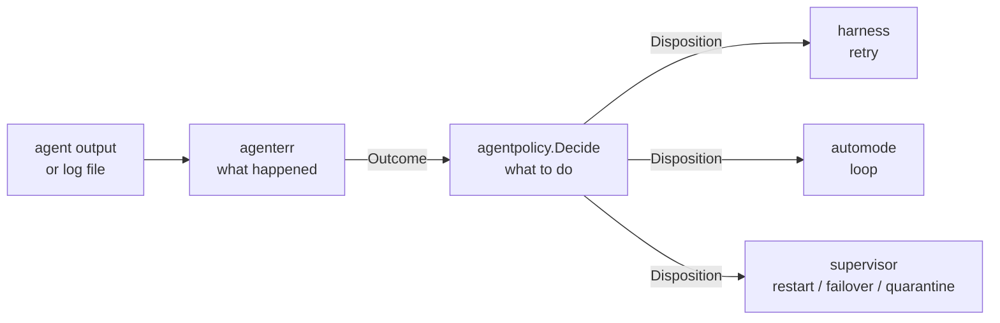

# Agent Failure Handling

Relevant source files

- `internal/agenterr/` — classification (`classify.go`, `error.go`, `outcome.go`)
- `internal/agentpolicy/policy.go` — the decision table
- `internal/harness/retry.go` — in-invocation retry layer
- `internal/cli/automode/automode_task.go` — auto-loop layer
- `internal/cli/daemon/supervisor/{restart,backend,quarantine}.go` — supervisor layer

## Purpose and Scope

An agent subprocess can fail in many ways — a rate limit, an expired login, a
crashed harness, a context overflow, a task with nothing to do — and loom has
three separate places that might react. This page describes how those reactions
are kept consistent.

It covers failure classification and the retry/escalation policy only. It does
not cover prompt construction (`internal/cli/agent`), backend invocation and
capability negotiation (`internal/cli/backends`), or session finalization
(`internal/sessions`, `internal/cli/sessionfinalize`) — read those packages' doc
comments. For import-direction rules, see [Module Layering](module-layering.md).

## The shape of the problem

Three layers can each respond to the same failure, at different timescales:

| Layer | Package | Reacts within |
|---|---|---|
| In-invocation retry | `internal/harness` | a single agent invocation |
| Auto-loop | `internal/cli/automode` | one agent's task loop |
| Daemon supervisor | `internal/cli/daemon/supervisor` | the fleet, across agents |

If each layer decided independently what a rate limit or an auth failure means,
they would drift — and the drift would show up as an agent that retries forever
in one path and fails immediately in another. So the verdict is centralized and
the state is not.

Sources: `internal/agentpolicy/policy.go:1-7`

## Classification and verdict are separate

Two packages, two questions:

`internal/agenterr` answers *what happened*. It classifies from a log file or
captured output into an `Outcome` — a single value that is **either** a harness
error class owned by the harness wrapper **or** a loom-domain outcome the
wrapper cannot represent. Exactly one side is meaningful; the zero value means
clean success and is handled before policy is consulted.

`internal/agentpolicy` answers *what to do*. `Decide` maps an `Outcome` to a
`Disposition`. It is a pure table — it holds no counters and performs no
actions.

The split matters because these two things change for different reasons. A new
failure mode is a classification change; deciding that rate limits should stop
eroding the retry budget is a policy change. Keeping them in one package would
make every such adjustment a change to both.

Sources: `internal/agenterr/outcome.go:44-62`, `internal/agentpolicy/policy.go:63-93`

## The verdict vocabulary

`Decision` is what a layer does:

| Decision | Meaning |
|---|---|
| `Retry` | restart; counts against the layer's retry budget |
| `RetryUncounted` | restart; does not erode the budget (rate limit, no work) |
| `Block` | budget spent: fixed-interval re-attempt rather than giving up |
| `Failover` | try the next configured backend |
| `FastFail` | deterministic failure; stop now and surface as failed |
| `StopFatal` | auth or billing; stop, a human is needed |

A `Disposition` carries more than the decision: a `BackoffProfile` naming which
configured backoff *shape* to use (not concrete durations — those stay in
`restart_policy` and automode config), a `HonorHint` flag saying whether the
harness's own `RetryAfter` should win over the schedule, an `OnExhaustion`
decision for what a counted retry becomes once its budget is spent, and
`BlockBudget` / `FailoverAfter` thresholds.

The distinction between `Retry` and `RetryUncounted` is the load-bearing one. A
rate limit is not the agent's fault, so retrying through one must not consume
the budget that exists to catch genuinely broken agents.

Sources: `internal/agentpolicy/policy.go:20-26`, `internal/agentpolicy/policy.go:63-77`

## Each layer owns its own state

The table returns a verdict. Every layer keeps its own counters, budgets, and
timers, and consults the table only for the verdict and the backoff bucket.

**In-invocation retry** (`internal/harness/retry.go`) asks whether to try again
inside one invocation: it retries when the decision is `Retry` or
`RetryUncounted` and stops otherwise. Its own backoff schedule applies, with a
non-zero `RetryAfter` hint from the harness taking precedence and both capped at
`MaxBackoff`.

**The auto-loop** (`internal/cli/automode/automode_task.go`) exits immediately on
`StopFatal`, `FastFail`, *and* `Failover`. The last is a local reading, not the
table's: auto-mode has no fallback backend configured, so "try the next backend"
is terminal there. `RetryUncounted` is routed to rate-limit handling *before*
per-task tracking, so a sustained rate limit against one task cannot drain that
task's stuck-task budget.

**The supervisor** (`internal/cli/daemon/supervisor/`) handles restart, backend
failover, and quarantine across the fleet. Quarantine shows the division most
clearly: eligibility is declared by `agentpolicy.QuarantineEligible`, while the
kill counts, the progress detection that drops a quarantine record when a task
advanced between kills, and the threshold itself live in the supervisor.

Sources: `internal/harness/retry.go:142-143`, `internal/cli/automode/automode_task.go:82-112`, `internal/cli/daemon/supervisor/quarantine.go:32-34`, `internal/cli/daemon/supervisor/quarantine.go:160`

## Markers beat prose

Classification prefers explicit signals over pattern-matching. `internal/agenterr`
declares marker constants — `AuthRequiredMarker`, `UsageLimitedMarker`,
`AgentLaunchFailedMarker`, `BackendUnavailableMarker` — that loom emits into
agent output. When a marker is present it determines the class outright.

Only failing that does classification fall through a cascade: the harness
wrapper's own `ClassifyOutput` gets first refusal, then loom's residual regex
table catches signals the wrapper's anchored matchers miss, and an exit-code
fallback catches the rest. The residual table exists precisely so loom does not
maintain five near-identical per-backend pattern sets.

This is why prose changes in a backend's error messages do not silently
reclassify a failure: the cases that matter most (an expired login, a missing
binary) are marked, not matched.

Sources: `internal/agenterr/classify.go:46,62,89,90` (markers), `internal/agenterr/classify.go:24-28` (residual table), `internal/agenterr/classify.go:222-224` (wrapper first)

## Adding a failure mode

1. Classify it in `internal/agenterr` — a marker if loom emits the condition
   itself, a pattern only if the signal comes from someone else's output.
2. Add the `Outcome` to the table in `internal/agentpolicy` with an explicit
   `Disposition` — `decideHarness` for a wrapper class, `decideDomain` for a
   loom-domain outcome. Add a case to `TestDecide_Golden` too: it pins most of
   the mapping but is not exhaustive, and `IncompleteRunOutcome` currently has
   no test of its own (it survives only because its explicit case returns the
   same `Disposition` as `decideDomain`'s `default`).
3. Change nothing in the three layers unless the new mode needs state none of
   them keeps. Adding a case to a layer's own switch is the drift this design
   exists to prevent.

Sources: `internal/agentpolicy/policy.go:88-118` (harness) and `policy.go:144-180` (domain), `internal/agentpolicy/policy_test.go:13` (`TestDecide_Golden`)

## Summary

Loom separates *what happened* (`internal/agenterr`) from *what to do about it*
(`internal/agentpolicy`), and centralizes only the verdict. Three layers — the
harness retry, the auto-loop, and the daemon supervisor — each keep their own
counters and backoff configuration but read one table, so a given failure means
the same thing at every timescale.

## References

- `internal/agenterr/outcome.go:44-62` — the `Outcome` carrier
- `internal/agenterr/classify.go:46,62,89,90` — marker constants
- `internal/agenterr/classify.go:218-226` — the numbered classification cascade
- `internal/agenterr/classify.go:24-28` — the residual regex table
- `internal/agentpolicy/policy.go:20-26` — `Decision` values
- `internal/agentpolicy/policy.go:63-93` — `Disposition` and `Decide`
- `internal/agentpolicy/policy.go:132` — `QuarantineEligible`
- `internal/agentpolicy/policy_test.go:13` — `TestDecide_Golden`, the table that pins every mapping
- `internal/harness/retry.go:142-151` — in-invocation retry and backoff
- `internal/cli/automode/automode_task.go:82-112` — auto-loop dispositions
- `internal/cli/daemon/supervisor/quarantine.go:32-34, 160` — quarantine seam
