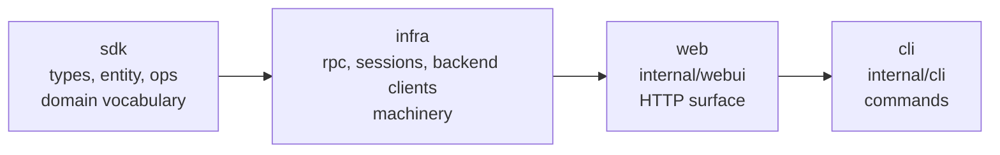

# Module Layering

Relevant source files

- `.golangci.yml` (the `depguard` block, lines 60–212)
- `internal/entity/doc.go`, `internal/ops/doc.go` — packages that state their own layer
- `internal/webui/service/` — the interface layer handlers are meant to depend on
- `internal/webui/svcimpl/` — where those interfaces are bound to implementations
- `internal/cli/data/` — the one command package held to SDK rules

## Purpose and Scope

This page describes how `internal/` is partitioned into dependency layers, which
imports each layer may make, and how much of that is actually enforced rather
than merely intended.

It covers the static import structure only. For what individual packages *do*,
read their package doc comments (`go doc ./internal/<pkg>`) — every package under
`internal/` carries one. For the runtime vocabulary these packages implement, see
`CONTEXT.md`. For the SSE framing invariant that constrains one specific package,
see `docs/adr/0001-sse-framing-single-writer-seam.md`.

Sources: `.golangci.yml:77-79`

## The four layers

Loom's internal packages are assigned to one of four layers. Dependencies run in
one direction only:

An arrow means "may be imported by". SDK is the innermost layer and imports none
of the others; `cli` is outermost and may import anything.

| Layer | Membership | May not import |
|---|---|---|
| sdk | `types`, `entity`, `backend` (root only), `notify`, `agenterr`, `authmode`, `workspaceerrors`, `events` (root only), `ops`, `httpclient` | any infra package, `webui`, `cli` |
| infra | `rpc`, `sessions`, `lockfile`, `circuitbreaker`, `kv`, `configlock`, `usage`, `logrouter`, `atomicfile`, `gitbranch`, `workspace`, `debug`, `testutil`, `backend/{mapping,fleet,agentipc,api}`, `events/otelexport` | `webui`, `cli` |
| web | `internal/webui/**` | `cli` |
| cli | `internal/cli/**` | — |

Two entries are deliberately split by file rather than by directory:
`internal/backend` is SDK at its root but its sub-packages (`fleet`, `api`,
`agentipc`, `mapping`) are infra, and `internal/events` is SDK at its root while
`events/otelexport` is infra. In both cases the root declares types and the
sub-packages bind them to a transport, so the split follows the dependency, not
the directory.

Sources: `.golangci.yml:80-173`

## Two rules that are not about layers

Beyond the four-layer stack, two narrower rules exist.

**`data-isolation`.** `internal/cli/data` sits in the `cli` tree but is held to
SDK rules: it may not import `cli` root, any `cli` sub-package, `webui`, or any
infra package. It reaches a loom server over HTTP through the generated OpenAPI
client and `internal/httpclient` and nothing else. This is what makes it usable
as a thin remote client without dragging the local runtime in behind it.

**`handler-layer-isolation`.** HTTP handlers are meant to depend on
`internal/webui/service` — a set of interfaces — rather than on `internal/store`,
`internal/backend`, `internal/notify`, or `internal/webui/daemon` directly.
`internal/webui/svcimpl` is where those interfaces are bound to real
collaborators, so the dependency on storage is concentrated in one package
instead of spread across every handler.

Sources: `.golangci.yml:62-76`, `.golangci.yml:174-212`

## Enforcement status

Layer membership is expressed as `depguard` rules in `.golangci.yml`, run by
`make lint` and by the `gate` target. This is enforcement, not documentation:
a violating import fails the build rather than being caught in review.

That holds for three of the five rules. The other two have gaps worth knowing
about.

| Rule | Enforced | Note |
|---|---|---|
| `sdk-leaf` | yes | one deliberate hole, below |
| `infra-isolation` | yes | |
| `webui-isolation` | yes | |
| `data-isolation` | yes | |
| `handler-layer-isolation` | **live, but guards the wrong package** | see below |

**`handler-layer-isolation` does not cover the handler tree.** Its file glob is
`**/handler/**` — singular. That matches `internal/webui/server/handler/`, a
six-file package of HTTP request/response helpers, and the rule is genuinely
live there: injecting a denied import into that package makes `depguard` fire.
What it does not match is `internal/webui/handlers/` — plural, the actual
handler tree the rule's own `desc` strings describe. So the rule passes today
not because handlers respect the boundary but because the one package it
selects happens to import nothing on the deny list.

Pointing the glob at `**/handlers/**` and re-running `depguard` over
`./internal/webui/handlers/...` reports **85 violations** across 14 handler
packages (41 in production files, 44 in tests), dominated by direct imports of
`internal/store` (46). The service layer this rule protects is real and widely
used; the rule is not guarding it. Closing the gap is a refactor, not a config
fix, and is deliberately left unmade here.

Note also that `internal/store` — the package accounting for most of those
violations — appears nowhere in any layer's `files:` list. By this page's own
"Adding a package" rule it is unlayered: it is named only as a deny target, so
nothing constrains what `store` itself may import.

**`sdk-leaf` has one documented hole.** `internal/workspace` is omitted from the
deny list because `depguard` matches package paths by prefix, and denying
`internal/workspace` would also deny `internal/workspaceerrors`, which is itself
an SDK package. No SDK package imports `workspace` today; nothing but review
prevents one from starting to.

That same prefix-matching behavior has a second instance: denying
`internal/backend` also matches `internal/backendnames`, a dependency-free
constants package that no layering rule intends to restrict. It surfaces as one
of the 85 handler violations above.

Sources: `.golangci.yml:62-76`, `.golangci.yml:113-115`, `Makefile:379-382`

## Where the layer definitions live

The `depguard` block carries a comment pointing at
`/Users/tyson/.claude/plans/purrfect-weaving-stream.md` for the layer
definitions. That path is outside the repository and resolves only on one
machine. This page is intended to replace that reference; the config comment
should point here instead.

Sources: `.golangci.yml:79`

## Adding a package

A new package under `internal/` is unlayered until it is named in
`.golangci.yml`. Nothing fails, and nothing enforces its boundary — the default
is silence, not rejection. When adding one:

1. Decide its layer from what it must import, not from where it sits in the tree.
2. Add it to that layer's `files` list, and to the `deny` lists of every inner
   layer that must not reach it.
3. Check that its import path is not a prefix of another package's — see the
   `workspace` / `workspaceerrors` case above.
4. State the layer in the package's doc comment, as `internal/entity` and
   `internal/ops` already do.

Sources: `.golangci.yml:77-78`, `internal/entity/doc.go`, `internal/ops/doc.go`

## Summary

Loom enforces a four-layer import structure — sdk → infra → web → cli — through
`depguard` rather than convention, plus two special-case rules for
`internal/cli/data` and for HTTP handlers. Four of the five rules guard what
they claim to. The handler rule is live but points at a singular
`server/handler` helper package rather than the plural `handlers/` tree it
describes; aiming it correctly surfaces 85 pre-existing violations.

For what each package does, see its own doc comment. For the domain vocabulary,
see `CONTEXT.md`.

## References

- `.golangci.yml:60-212` — all five `depguard` rules
- `.golangci.yml:77-79` — layer order and the external definitions reference
- `.golangci.yml:113-115` — the `workspace` / `workspaceerrors` prefix note
- `Makefile:379-382` — `make lint`
- `internal/entity/doc.go`, `internal/ops/doc.go` — packages declaring their layer
- `CONTEXT.md` — domain vocabulary
- `docs/adr/0001-sse-framing-single-writer-seam.md` — the realtime framing seam
