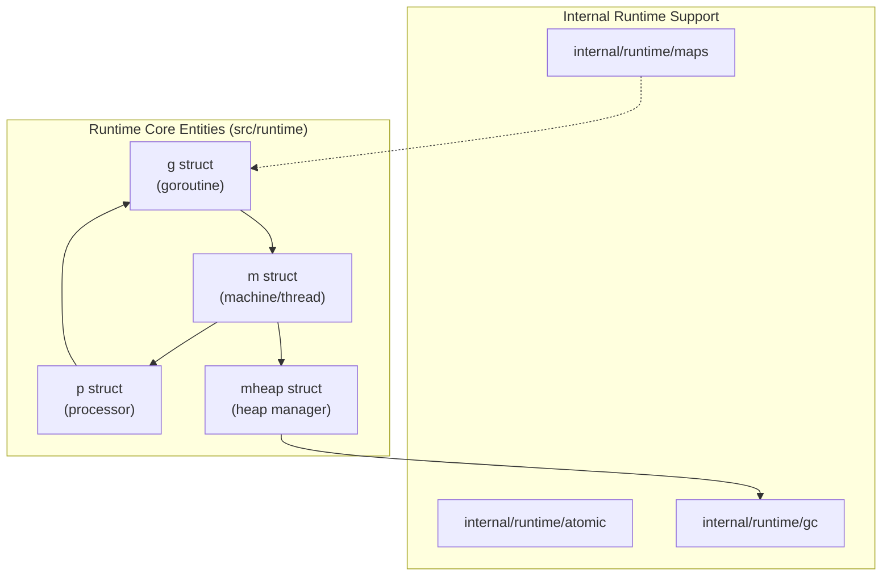
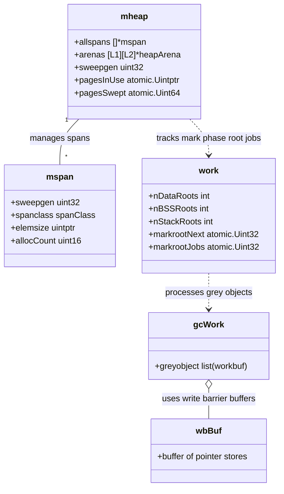
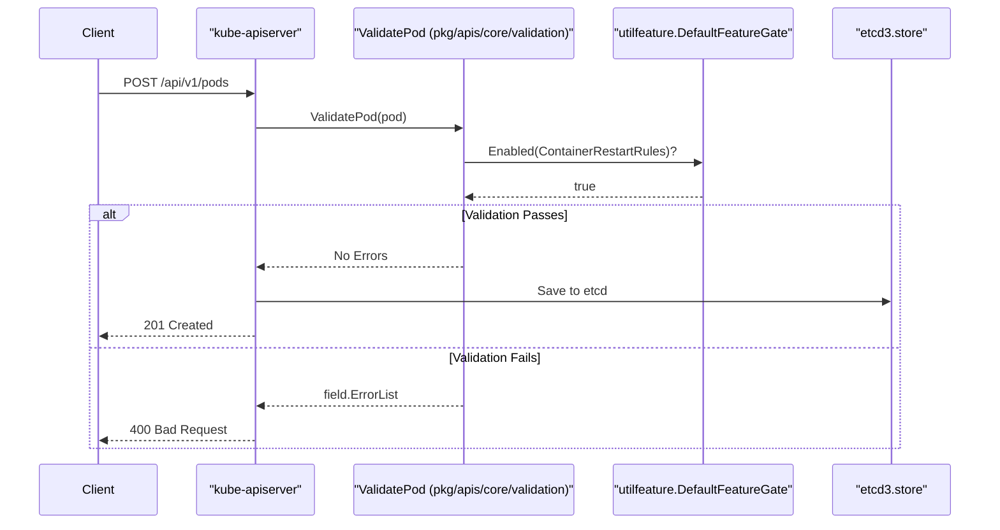

# Devin CodeWiki / Devin Wiki / DeepWiki: documentation-pattern research

Date: 2026-09-03

Status: primary-source survey, for the purpose of porting documentation *patterns* into hand-written Go monorepo architecture docs. Not a product review.

Scope: this document reports only what I could verify against Cognition's own docs/blog and the live deepwiki.com product. Every claim is cited. Where I could not verify something against a primary source, that is stated explicitly rather than filled in from general knowledge or third-party blog posts.

**Method note on the diagram/citation evidence below:** deepwiki.com is a Next.js app; a plain HTTP GET or a naive page-summarizing fetch only returns the pre-render shell and does **not** see the Mermaid diagrams (they render client-side to SVG) or the raw markdown source. To get ground truth I did two things: (1) drove a real headless browser to the live page and inspected the rendered DOM/screenshots, and (2) fetched the page with the `RSC: 1` header, which returns Next.js's React Server Component payload — the actual markdown/Mermaid source the client renders, unprocessed. Both are the product's own served output, not a third party's description of it. I sampled `golang/go` (most thoroughly) and `kubernetes/kubernetes` (as a cross-check) plus specific sub-pages of each.

---

## 1. What it is, per Cognition

Cognition's own announcement (published 2025-05-05, updated 2025-09-04): "It shouldn't take hours to get up to speed on a new codebase. That's why we built [Devin Wiki] and [Devin Search], tools that help developers quickly grok and understand complex code. Now, we're launching DeepWiki, the free public version of Devin Wiki and Devin Search. Visit the DeepWiki for any repo by replacing github.com with deepwiki.com in the URL." The page's own meta description: "Turn any public GitHub repo into up-to-date documentation you can talk to, for free." It states DeepWiki had "already indexed over 50,000 of the top public GitHub repos, from the Model Context Protocol to LangChain" at launch ([cognition.com/blog/deepwiki](https://cognition.com/blog/deepwiki)).

The product docs describe the mechanism directly: "Devin now automatically indexes your repos and produces wikis with architecture diagrams, links to sources, and summaries of your codebase," and "DeepWiki auto-generates architecture diagrams, documentation, and source links for every repo, configured with a `.devin/wiki.json` file." Generation is tied to onboarding: "DeepWiki will be autogenerated when connecting repositories during onboarding" ([docs.devin.ai/work-with-devin/deepwiki](https://docs.devin.ai/work-with-devin/deepwiki)).

Indexing is a distinct prerequisite step, documented separately: "Repository indexing is separate from environment configuration. Indexing enables code search and understanding features, while environment configuration sets up Devin's development environment... Once complete, you'll have access to: Ask Devin... DeepWiki" ([docs.devin.ai/onboard-devin/index-repo](https://docs.devin.ai/onboard-devin/index-repo)).

Cognition explicitly frames the free public product as a reduced-capability version of the paid one: "The full Ask Devin experience, including advanced code search, planning, and session creation, is available in the Devin app... Public DeepWiki and the DeepWiki MCP provide basic documentation and Q&A capabilities" ([docs.devin.ai/work-with-devin/deepwiki](https://docs.devin.ai/work-with-devin/deepwiki)).

One naming note I can only partially resolve from primary sources: the original blog post links to `docs.devin.ai/work-with-devin/devin-wiki` as the "Devin Wiki" doc page. That URL now 404s (verified live, 2026-09-03) — the content appears to have been consolidated into the current `docs.devin.ai/work-with-devin/deepwiki` page, which now covers both the in-product ("Devin Wiki") and public ("DeepWiki") surfaces under one name. I could not find a primary source explaining the rename/merge explicitly; I'm reporting the redirect-to-404 as a directly observed fact, not the reasoning behind it.

## 2. Wiki-level taxonomy and hierarchy

Per the primary config docs, page structure is normally decided automatically ("cluster-based planning" is the term the docs use for the default, contrasted with explicit configuration), but any repo can override it with a `.devin/wiki.json` file at the repo root. The docs state: "If a `.devin/wiki.json` file is found... we'll use the provided `repo_notes` and `pages` to steer wiki generation... When a config file is present, we bypass the default cluster-based planning and create exactly the pages you specify" ([docs.devin.ai/work-with-devin/deepwiki](https://docs.devin.ai/work-with-devin/deepwiki)).

Each page entry is `{title (required), purpose (required), parent (optional, "Title of the parent page for hierarchical organization"), page_notes (optional)}`. Hierarchy depth is not capped in the schema itself, but the docs' own worked example only goes two `parent` links deep (Architecture Overview → Frontend → React Components) ([docs.devin.ai/work-with-devin/deepwiki](https://docs.devin.ai/work-with-devin/deepwiki)).

Stated hard limits: **max 30 pages per wiki (80 for enterprise)**, **max 100 total notes** (`repo_notes` + all `page_notes` combined), **max 10,000 characters per note**, and page titles must be unique ([docs.devin.ai/work-with-devin/deepwiki](https://docs.devin.ai/work-with-devin/deepwiki)).

Empirically, on both repos I sampled, the *rendered* hierarchy goes three levels deep, numbered like a document outline (`1`, `1.1`, `3.5.2`), and both wikis end with a top-level **Glossary** page:

- `golang/go`: 7 top-level sections (Overview of Go; Go Runtime; Go Compiler; Build System; Standard Library; Language Specification and Documentation; Glossary), several with two levels of children (e.g. `3. Go Compiler → 3.5 Backend and Code Generation → 3.5.2 Assembler`).
- `kubernetes/kubernetes`: 10 top-level sections (Overview; Core API System and Feature Management; Control Plane Components; Node Components; Cluster Bootstrap and Management; client-go and API Machinery; kubectl and CLI Tools; Testing Infrastructure; Build System and Dependencies; Glossary), grouped by *subsystem*, not by directory layout.

Both hierarchies are organized by **runtime subsystem / concern**, not by literal directory tree — e.g. `golang/go`'s top-level split is Runtime / Compiler / Build System / Standard Library, which cuts across `src/` rather than mirroring it 1:1. A separate "Repository Structure" page exists specifically to document the literal directory tree, subordinate to the top-level "Overview" page.

## 3. The page template (distilled from real generated pages)

This is the reusable skeleton, confirmed both in the rendered page (screenshots, DOM) and in the raw markdown/Mermaid source for `golang/go`'s "Overview of Go" and "Goroutine Scheduler" pages and `kubernetes/kubernetes`'s overview and "Reflector" section — the same skeleton recurred on every page sampled.

**In-document heading skeleton** (bare list, as requested):

- `# <Page Title>` (H1 — matches the sidebar link text verbatim)
- `<details><summary>Relevant source files</summary>...</details>` (collapsed by default; not a heading, but always the first content block)
- `## Purpose and Scope`
- `## <Topic section 1>` (repeats, N times, sometimes with `###` sub-sections)
- `## <Topic section 2>`
- … (as many topic sections as the page needs)
- `## Summary` (present on most, not literally every, page)
- `## References` / `## References and Sources` / `## Sources` (closing section; naming varies slightly page to page, function is identical)

**Section-by-section detail:**

1. **Title (H1).** Exactly matches the sidebar entry. No subtitle line under it.

2. **"Relevant source files" (collapsible, before any heading).** Verbatim opening text observed on every page: `The following files were used as context for generating this wiki page:` followed by a flat bullet list of every file path used as generation input for that page (e.g. 40+ files for "Overview of Go"), each a markdown link to that file in the repo. This is a *generation-input manifest*, not a citation list — it's broader than (and mostly disjoint from) the specific `file:line` citations that follow in the body. Rendered as a collapsed `› Relevant source files` toggle directly beneath the H1.

3. **`## Purpose and Scope`.** Always the first heading. One to three short paragraphs stating what this specific page covers, then an explicit scope-fence: a bullet list of sibling/child pages with a one-line description of what *they* cover instead, formatted as anchor links matching the sidebar's numbering, e.g. `**[Repository Structure](#1.1)** — Organization of the source tree, including cmd/, src/, test/, lib/, and api/.` This section ends with its own `Sources:` citation line (see §5).

4. **Topic body sections (`##`/`###`).** The bulk of the page. Each one is typically: a short prose paragraph → optionally a table → optionally a Mermaid diagram → a `Sources:` (or `**Sources**:`) footer line. Not every section has all three of {prose, table, diagram} — many are prose + citations only; diagrams and tables are used where they add something a paragraph doesn't (see §4 and §6). Deeply technical pages (e.g. "Goroutine Scheduler") interleave `###` sub-sections that pair a mechanism description with a diagram (state machine, sequence, or flowchart) and/or a small reference table (state → description).

5. **`## Summary`.** A short (1–3 sentence) recap, usually restating the page's role and re-linking to the same sibling pages named in "Purpose and Scope" ("For details on X, see **[Sibling Page](#anchor)**.").

6. **`## References` / `## References and Sources`.** A page-level, *deduplicated* bibliography: one bullet per file, with all the line ranges cited anywhere on the page joined by commas (e.g. `src/cmd/dist/build.go:71-107, 110-280`), no longer using the inline link syntax — plain text. This is distinct from both the top "Relevant source files" manifest (broader, unstructured) and the per-section `Sources:` lines (narrower, per-section).

**Page furniture that is part of the delivered page but outside the markdown body** (observed live, not in the raw source — this is chrome the site wraps around every page):

- Left sidebar: the full wiki's hierarchical table of contents (all pages, all levels), with the current page highlighted.
- A "Last indexed: `<date>` (`<short-commit-sha>`)" line above the sidebar TOC, with the SHA linking to `github.com/<org>/<repo>/commits/<sha>`.
- A "Refresh this wiki" panel (see §8) showing whether a manual refresh is currently allowed.
- Right rail: an auto-generated "On this page" table of contents (in-page headings only).
- Top bar: repo name, an "Edit Wiki" button (opens a steering/chat affordance for that specific page), a "Share" button, dark-mode toggle.
- A persistent "Ask Devin about `<repo>`" chat input pinned to the bottom of the viewport on every page.

## 4. Diagram conventions (observed)

All diagrams are Mermaid, rendered client-side (confirmed via DOM inspection: SVGs carry `aria-roledescription="flowchart-v2"` / `"stateDiagram"`, Mermaid's own CSS classes, and per-diagram `#mermaid-<hash>` containers with "Zoom in"/"Zoom out" controls — none of this exists in the raw HTML before JS runs, which is why a plain fetch reports "no diagrams").

From the raw Mermaid source across the two repos' full wikis, by first-line directive:

| golang/go (119 blocks) | kubernetes/kubernetes (103 blocks) |
|---|---|
| `graph` (TD/LR/TB): 86 | `graph`: 83 |
| `flowchart` (TD/LR): 22 | `flowchart`: 1 |
| `stateDiagram-v2`: 3 | `stateDiagram-v2`: 2 |
| `classDiagram`: 3 | `classDiagram`: 2 |
| `sequenceDiagram`: 2 | `sequenceDiagram`: **15** |

Flowchart-family diagrams (`graph`/`flowchart`) dominate in both, used for directory trees, dependency graphs, and pipeline/data-flow diagrams. `sequenceDiagram` is rare in `golang/go` (a CLI/compiler toolchain has few multi-actor request flows) but common in `kubernetes/kubernetes` (a control-plane system with many client↔server↔etcd flows) — the choice tracks the underlying system's shape, not a fixed per-page quota. I did not find `erDiagram`, `gantt`, `pie`, `gitGraph`, `journey`, `mindmap`, `quadrantChart`, or `sankey` in either wiki; I can't rule these out of DeepWiki's repertoire generally (I only sampled two Go-ish/systems repos, neither with a relational schema), so treat "not observed" as a sampling limit, not a stated restriction.

Placement: a diagram always sits inside a topic body section, after a short framing paragraph and before (or immediately followed by) that section's `Sources:` line — never as page-opening hero art, never replacing the prose.

**One verbatim example of each type actually observed**, transcribed from the raw source:

Flowchart (`graph TD`, from `golang/go`'s "System State and Entities" section):


State diagram (`stateDiagram-v2`, from `golang/go`'s "Goroutine State Transitions"), depicting a lifecycle:
```mermaid
stateDiagram-v2
    [*] --> "_Gidle" : "newproc"
    "_Gidle" --> "_Grunnable" : "makes ready"
    "_Grunnable" --> "_Grunning" : "scheduled"
    "_Grunning" --> "_Gsyscall" : "enters syscall"
    "_Grunning" --> "_Gwaiting" : "blocks/parks"
    "_Grunning" --> "_Gdead" : "goexit"
    "_Gsyscall" --> "_Grunnable" : "exitsyscall"
    "_Gwaiting" --> "_Grunnable" : "ready()"
    "_Grunning" --> "_Gcopystack" : "stack growth copy"
```

Class diagram (`classDiagram`, from `golang/go`'s garbage collector coverage), depicting data-structure relationships (not OO class hierarchy — Go has no classes; it's used for struct-to-struct relationships):


Sequence diagram (`sequenceDiagram`, from `kubernetes/kubernetes`'s pod-validation coverage), depicting a request/control flow with branching:


## 5. Citation conventions (observed)

This is the mechanism, transcribed directly from the raw markdown source:

**Raw syntax:** `[path/to/file.go:startLine-endLine]()` — a markdown link whose *text* is the file path plus a line range, and whose *href is empty*. Example, verbatim from source: `[src/cmd/dist/build.go:110-280]()`.

**Client-side rewrite:** the empty href is not left broken — the rendered page turns each of these into a real link to `https://github.com/<org>/<repo>/blob/<pinned-commit-sha>/<path>#L<start>-L<end>`, rendered as a small pill with a GitHub icon (confirmed by screenshot and by inspecting the live DOM, where the same citation appears as `<a href="https://github.com/golang/go/blob/603439a1/src/runtime/proc.go#L25-L40">`). Critically, the link target is pinned to the specific commit the wiki was generated from, not `HEAD`/`main` — so a citation stays correct even after the file is later edited.

**Three placements, all using the same `[path:range]()` syntax:**
1. **Inline, end of sentence or bullet:** `...Rewriting import paths to reference the bootstrap workspace [src/cmd/dist/buildtool.go:171-216]().` (this is the most common placement — roughly 1,400 of ~1,835 citation instances counted across `golang/go`'s wiki were inline like this, versus ~420 in per-section `Sources:` lines).
2. **Inside a table cell** (usually the last column): `| pkg/ | Compiled packages and toolchain artifacts | pkg/tool/, pkg/bootstrap/ [src/cmd/dist/buildtool.go:165-168]() |`.
3. **Section-level footer**, one line closing almost every `##`/`###` section, listing every citation used in that section: `Sources: [src/cmd/dist/build.go:110-280](), [src/cmd/dist/test.go:27-56](), [src/go/build/deps_test.go:24-120]()`. Both `Sources:` and bold `**Sources**:` variants appear; function is identical.

**Page-level closing bibliography** (the `## References and Sources` section, §3): same underlying citations, but *deduplicated per file* and no longer using the link syntax — plain text, multiple ranges comma-joined: `src/cmd/dist/build.go:71-107, 110-280`.

**Granularity:** always file + line range, never just a file name and never a whole-file link. I did not see any citation coarser than a line range (e.g. "see the `runtime` package") standing in for a specific claim.

## 6. Tables (recurring shapes)

Shapes actually observed, not a generic guess:

- **Component inventory:** `Component | Location | Overview` — one row per major subsystem, location as a code-styled path, overview as a one-sentence description (`golang/go`'s "Major Components").
- **Directory layout:** `Directory | Purpose` (with an inline `[file:line]()` citation appended in the Purpose cell) — one row per top-level directory (`kubernetes/kubernetes`'s "Repository Organization").
- **Enum/state table:** `State | Value | Description` (Go's goroutine states) and the two-column variant `State | Description` (processor states) — one row per enum member.
- **Grouping table:** `Queue Type | Description` — one row per named category.
- **Dependency-tier classification table:** `Tier | Packages | Description [+ citation]` — derived from a build-graph test file (`golang/go`'s `deps_test.go`-sourced NONE/RUNTIME/SYSCALL tiers), i.e. the table content is itself extracted from a machine-checkable source of truth in the repo, not free-written prose.
- **Struct-as-bullets (table alternative):** when documenting a single struct's fields/methods, DeepWiki does **not** always reach for a table — `kubernetes/kubernetes`'s "Key Functions and Classes" instead uses nested bullets, one per field/method, each with its type, a one-line description, and an inline citation. Tables appear to be reserved for *multi-item, columnar* comparisons; single-entity field listings are bulleted instead.

## 7. Level of abstraction

**What vs. why:** sections are dominated by "what" (component roles, state names, call sequences) with a thin layer of "why" limited to *purpose statements* ("provides the environment for program execution and concurrency") rather than *design rationale* (I did not find passages of the form "X was chosen over Y because..." or discussion of trade-offs/alternatives considered, in either wiki sampled). Treat this as an observation bounded by my sample (two systems repos), not a claim about DeepWiki's ceiling — I did not exhaustively search for rationale-style prose across either wiki.

**Internals vs. public surface:** DeepWiki documents unexported internals freely and in detail — the `golang/go` wiki names and explains unexported runtime structs (`g`, `m`, `p`, `mheap`, `mspan`), unexported functions (`mallocgc`), and internal packages (`internal/runtime/gc`) at the same depth as exported API. It is explicitly *not* limited to public API surface.

**Plumbing packages:** I did not fetch a page for a purely mechanical/plumbing package specifically to test this, so I cannot make a verified claim about how DeepWiki handles low-signal glue code — flagging this as unverified rather than guessing.

## 8. Freshness and regeneration

**What the docs state:** generation is tied to onboarding ("DeepWiki will be autogenerated when connecting repositories during onboarding") and to indexing a chosen branch; the docs recommend "index the branches your team actively develops on. This ensures Ask Devin and DeepWiki have the most up-to-date understanding of your code" ([docs.devin.ai/onboard-devin/index-repo](https://docs.devin.ai/onboard-devin/index-repo)). The steering-config workflow ends with a manual step: "Commit the file and regenerate your wiki" ([docs.devin.ai/work-with-devin/deepwiki](https://docs.devin.ai/work-with-devin/deepwiki)). I found **no primary-source statement of an automatic per-commit or scheduled regeneration cadence** for either the private (Devin Wiki) or public (DeepWiki) product.

**What I directly observed in the live product** (`deepwiki.com/golang/go`, checked 2026-09-03): the sidebar displays **"Last indexed: 31 August 2026 (603439)"**, where `603439` is a short commit SHA linking to `github.com/golang/go/commits/603439a1`, and a "Refresh this wiki" panel reads verbatim: **"This wiki was recently refreshed. Please wait 4 days to refresh again."** So the mechanism is: each wiki is pinned to one specific commit (visible to the reader), and refreshing to a newer commit is a manual, rate-limited action — not continuous sync. Whether "4 days" is a fixed global cooldown or something else I did not test on a second repo, so treat the specific number as observed-on-this-repo rather than a documented universal constant.

**A claim I explicitly did not verify:** several secondary/third-party sources (not Cognition) assert that "wikis are regenerated on a schedule, not on every commit... may lag main by hours to days." This is *directionally* consistent with what I verified above (pinned commit + non-continuous refresh) but I could not find this specific cadence claim in `docs.devin.ai` or `cognition.com`, so I'm not treating it as a citable fact — flagging the gap rather than asserting it.

**Supporting detail — generation is metered, not free templating:** the docs expose three "effort levels" with real cost: Low (default, free), Medium (~5–10 ACUs per wiki, requires subscription/credits), High (~20–40 ACUs per wiki, same requirement); "Enterprise orgs always run at low effort; the setting is not configurable for them" ([docs.devin.ai/work-with-devin/deepwiki](https://docs.devin.ai/work-with-devin/deepwiki)). This confirms generation is an actual agentic LLM run over the repo (billed in Devin's own compute-unit currency), not a cheap static-analysis pass — which is directly relevant to why the refresh cadence is throttled (§10).

## 9. Stated limits (per Cognition, primary)

- Hard ceilings on wiki size: **max 30 pages (80 enterprise)**, **max 100 total notes**, **10,000 characters/note** ([docs.devin.ai/work-with-devin/deepwiki](https://docs.devin.ai/work-with-devin/deepwiki)).
- Enterprise tier is capped to the "Low" effort level with no override ([docs.devin.ai/work-with-devin/deepwiki](https://docs.devin.ai/work-with-devin/deepwiki)).
- The free public product is explicitly scoped down from the paid one: "basic documentation and Q&A capabilities" only, vs. "advanced code search, planning, and session creation" in the full Devin app ([docs.devin.ai/work-with-devin/deepwiki](https://docs.devin.ai/work-with-devin/deepwiki)).
- Cognition's own troubleshooting section is an implicit admission of a known failure mode for large repos: two of its three documented issues are **"Only certain folders are being documented"** and **"Important components are missing from the wiki,"** both attributed to the default automatic clustering, with `.devin/wiki.json` as the prescribed fix ([docs.devin.ai/work-with-devin/deepwiki](https://docs.devin.ai/work-with-devin/deepwiki)).
- I found **no explicit "DeepWiki is not good for X" disclaimer** (e.g., no stated warning against using it for security review, no stated accuracy/hallucination caveat) in any primary page I fetched. Absence of a found statement is not the same as Cognition having no such caveat somewhere I didn't reach — flagging as not-found rather than "they say it's fine for everything."

## 10. What to copy vs. what only works because it's machine-generated

**Copy — cheap, portable to hand-written docs, no regeneration required:**

- The **"Purpose and Scope" opening + explicit scope-fence to sibling pages** (§3.3). This costs one paragraph and a bullet list to write by hand, and it's exactly the discipline C4/arc42 already recommend for keeping a document's boundary honest (see this repo's sibling survey, `docs/design/2026-09-03-architecture-and-module-documentation-research.md`, on audience/boundary discipline).
- The **`path/to/file.go:start-end` citation format itself**, written as plain text next to a claim (skip the GitHub-blob-link automation — a human or agent can write the range by hand at doc-writing time). Low cost, immediately falsifiable/checkable by a reader, and it's exactly the "point at code, don't restate it" instinct worth keeping.
- The **`## Summary` + `## References`/`## Sources` closing skeleton** — cheap structural discipline, easy to keep current because it's short.
- The **recurring table shapes** (component→location→purpose; state→value→description) as literal templates to reuse — they're generic enough to fit most Go package docs.
- **Diagram-type-by-content-shape heuristic**: flowchart for structure/pipeline/dependency, sequence for a request or control flow across components, state diagram for a lifecycle/state machine, class diagram for data-structure relationships — not a fixed quota per page, but a rule for *which* diagram to reach for.
- The **"Relevant source files" manifest** as a concept — even a short "this doc covers `pkg/foo/*.go`" line at the top of a hand-written doc gives a reader the same scoping value at near-zero cost.

**Do not try to sustain by hand — these only work because generation is cheap and repeatable:**

- **The pinned-commit + "last indexed" + cooldown-gated refresh badge** (§8). This exists because a full-repo LLM pass can be re-run periodically for a few compute units; a human cannot re-derive and re-verify an entire module doc every few days. Hand-written docs need a *different* staleness signal — e.g., a "last reviewed" date plus a CI check that flags when the files it names have changed since — not a "refresh whole doc" affordance.
- **Exhaustive, blanket-per-sentence inline citation density.** ~1,400 of `golang/go`'s wiki citations are inline, essentially footnoting nearly every sentence/bullet. A generator can mechanically emit a citation for every claim it makes; a human maintaining that density across every future edit is a losing proposition — it will rot faster than the prose does. Cite selectively by hand: interfaces, invariants, non-obvious behavior, and anything a reviewer would otherwise have to go hunting for — not every sentence.
- **Wiki-wide breadth (30–80 full pages per repo, each with its own diagrams/tables/citations).** DeepWiki can afford to generate dozens of complete pages because marginal generation cost is an LLM run, not engineer-hours. A team hand-writing docs should be far more selective about what earns its own page — this is the same conclusion the sibling survey draws independently from C4/arc42 ("match the diagram/document to a specific, named audience and stop there").
- **Automatic "cluster-based" hierarchy derivation from the actual module graph** (§2). DeepWiki's default page taxonomy is inferred from the codebase itself and can be regenerated when the codebase's shape changes. A hand-written doc set has to pick its taxonomy once and will drift from the real dependency graph over time with no automatic re-clustering fallback — this is an argument *for* generating specific artifacts (like a dependency graph or the tier-classification table in §6) with a small script rather than hand-maintaining them, even inside an otherwise hand-written doc set.
- **The build-graph-derived classification table** (e.g. Go's NONE/RUNTIME/SYSCALL package tiers, itself sourced from `deps_test.go`). This one table is a case where the honest answer is "generate this specific artifact with a script that parses the real dependency data," not "write it by hand and let it rot" — same conclusion the C4 "Code level" guidance reaches for its lowest level of detail.

## 11. Source table

| URL | Authoritative for | What I actually observed there |
|---|---|---|
| [docs.devin.ai/work-with-devin/deepwiki](https://docs.devin.ai/work-with-devin/deepwiki) | Feature docs: `.devin/wiki.json` schema, page/note limits, effort levels & cost, troubleshooting | Full config schema + 4 worked examples; page/note hard limits; effort-level cost table; two documented large-repo failure modes; "autogenerated... during onboarding" |
| [docs.devin.ai/work-with-devin/deepwiki-mcp](https://docs.devin.ai/work-with-devin/deepwiki-mcp) | The MCP server surface | 3 tools (`read_wiki_structure`, `read_wiki_contents`, `ask_question`); two wire protocols; endpoint URLs |
| [docs.devin.ai/onboard-devin/index-repo](https://docs.devin.ai/onboard-devin/index-repo) | How indexing relates to DeepWiki | Indexing is a distinct prerequisite step from environment config; recommends indexing actively-developed branches for freshness |
| [cognition.com/blog/deepwiki](https://cognition.com/blog/deepwiki) | Product framing/positioning, launch facts | Full announcement text (2025-05-05, updated 2025-09-04): "free public version of Devin Wiki and Devin Search"; 50,000+ repos indexed at launch; access-by-URL-substitution |
| [docs.devin.ai/work-with-devin/devin-wiki](https://docs.devin.ai/work-with-devin/devin-wiki) | (historical) — linked from the 2025 blog post | Currently 404s live (checked 2026-09-03); content appears consolidated into the `deepwiki` doc page above |
| [deepwiki.com/golang/go](https://deepwiki.com/golang/go) + subpages (`2.1-goroutine-scheduler`, etc.) | Empirical ground truth for page anatomy, diagrams, citations, freshness UI | Full page skeleton (§3); 119 raw Mermaid blocks (4 distinct types, verbatim examples in §4); 1,835 raw citation links and their 3 placements (§5); recurring table shapes (§6); "Last indexed (commit)" + refresh-cooldown UI (§8) |
| [deepwiki.com/kubernetes/kubernetes](https://deepwiki.com/kubernetes/kubernetes) | Cross-check on a second, independent repo | Same recurring headings ("Purpose and Scope" ×19, "Summary" ×5 in this wiki); 103 raw Mermaid blocks, notably 15 `sequenceDiagram`s (vs. 2 in `golang/go`) reflecting its control-plane request-flow shape; confirms diagram-type choice tracks system shape, not a fixed template |
