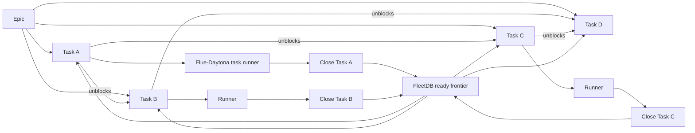

# Flue and Daytona Runtime Proposal

**Status:** Draft
**Date:** 2026-06-02
**Related:**
- `docs/design/distributed-control-plane.md`
- `docs/product/container-runner-mvp-spec.md`
- `docs/product/session-artifact-contract.md`
- `docs/product/orchestrator-worker-model.md`
- `internal/cli/backend.go`
- `internal/cli/daemon/supervisor/spawn.go`
- `internal/cli/agent/prompts/task.md`
- `internal/cli/agent/prompts/fleet_task.md`

## Purpose

This proposal defines how Loom can use Flue as an agent backend and
Daytona as an isolated remote sandbox without losing Loom's existing
control-plane behavior: FleetDB tasks, daemon supervision, sessions,
logs, diffs, and user-visible run status.

The important distinction is that **Flue backend integration** and
**Flue sandbox selection** are separate decisions.

```text
Loom backend adapter:
  Converts a Loom prompt/session/worktree invocation into a Flue run.

Flue sandbox:
  Decides where the agent's filesystem and shell tools execute.
```

For a local backend, the sandbox can be the existing Loom worktree. For
Daytona, the sandbox is a remote Linux machine. That changes where files
live, where `loom data` commands execute, where logs are produced, and
how final diffs return to Loom.

## Executive Summary

Use Flue as an additive backend, not as a replacement for the Loom
runtime. Loom should continue to own task selection, agent supervision,
sessions, artifacts, and UI-visible lifecycle. Flue should own prompt
execution, model/tool orchestration, and sandbox-backed file/shell tools.

The rollout should be phased:

| Phase | Name | Core idea |
|---|---|---|
| 1 | Flue local backend | Run Flue in the local Loom worktree with Flue `local()` sandbox. |
| 2 | Flue-Daytona per task | Run each task in a fresh Daytona sandbox and sync a patch back locally. |
| 3 | Persistent Daytona lead agent | Give each lead agent one durable Daytona machine that survives branch changes. |
| 4 | Loom server scale-out | Let Loom server provision hundreds of Flue-Daytona task sandboxes. |

The key correction from the earlier backend-only framing is this:

> Daytona is not just a backend flag. It is a remote workspace boundary.
> Once a task runs in Daytona, Loom must intentionally hydrate the repo,
> provide task/data access, stream logs, collect artifacts, and return
> changes before finalization.

## Terms

| Term | Meaning |
|---|---|
| Backend | Loom's AI backend interface from `internal/cli/backend.go`. |
| Flue runner | A local or server-side process that initializes a Flue harness and runs a prompt. |
| Sandbox | Flue filesystem and command-execution boundary. |
| `local()` sandbox | Flue Node sandbox that uses the host filesystem and shell. |
| Daytona sandbox | Application-owned remote Linux environment adapted through Flue's `SandboxFactory`. |
| Task agent | A short-lived implementation or planning agent that works one task. |
| Lead agent | A persistent long-running coordinator/chat agent. |
| Patch sync | Applying remote Daytona changes back into Loom's local worktree before session finalization. |
| Branch assignment | The branch a persistent lead agent should currently work on inside its durable sandbox. |
| Runtime provider | The execution substrate: local, daemon, Podman, Daytona, Kubernetes, etc. |
| Dependency graph | FleetDB issue dependencies inside an epic. A task is runnable only when its blockers are complete. |
| Ready frontier | The current set of open, unblocked tasks in an epic that can receive leases. |

## Current Loom Runtime Shape

Loom already has a useful backend extension point:

```go
type Backend interface {
    Name() string
    InvokeInteractive(workDir, prompt, agentName string) error
    InvokeNonInteractive(workDir, prompt, agentName string, shutdown <-chan struct{}, collector *usage.Collector) error
}
```

The daemon path is:

```text
loom daemon supervisor
  -> spawn loom task/plan/agent subprocess
    -> generate task/plan prompt
      -> invoke active backend
        -> backend CLI/harness executes
      -> finalize session against local worktree
```

Important current assumptions:

- `internal/cli/daemon/supervisor/spawn.go` sets `LOOM_AGENT_NAME`,
  `LOOM_WORKTREE_PATH`, session env, task assignment env, and routing
  env before invoking the child `loom` process.
- `internal/cli/agent/task.go` and `internal/cli/agent/plan.go`
  capture a local `beforeRef`, invoke the backend, then finalize by
  computing local git diff stats against the worktree path.
- Current prompts tell task agents to use `loom data` commands for
  task inspection, claim/update/close, notes, and review transitions.
- Fleet-assigned task prompts avoid `loom data ready` and `loom data
  claim`, but still instruct the agent to run `loom data show`, update,
  block, reopen, and close commands.
- Session finalization currently has backend-specific native transcript
  sync for Codex and Claude, and generic metadata/diff capture from the
  local worktree.

These assumptions are fine for local Flue. They need explicit adaptation
for Daytona.

## Flue Sandbox Model

Flue agents configure `sandbox` and `cwd` in `createAgent(...)`.
`init(...)` initializes the already-configured environment. The selected
sandbox controls the filesystem, shell commands, and model-facing tools.

Relevant sandbox choices:

| Sandbox | Use for Loom? | Notes |
|---|---|---|
| Flue default lightweight sandbox | Mostly no | Fresh in-memory filesystem, not the repo, not a general Linux checkout. Useful for staged documents or planning. |
| Flue `local()` | Yes, Phase 1 | Uses host filesystem and shell. Best first backend because Loom's local worktree and finalizer keep working. No isolation. |
| Flue Daytona connector | Yes, Phases 2-4 | Wraps an application-owned Daytona sandbox. Full remote Linux environment. Requires lifecycle, hydration, credentials, logs, and sync. |

Daytona integration is application-owned:

- Loom or the Flue runner creates the Daytona sandbox.
- Loom decides image/snapshot, region/target, env vars, and retention.
- Flue adapts the sandbox into a `SessionEnv`.
- Flue does not automatically delete Daytona sandboxes.
- Flue cannot make remote command cancellation stronger than the
  provider SDK supports.

## Proposed Architecture

### Backend Adapter Boundary

Add a first-class Flue backend to Loom. The backend should delegate to a
runner rather than trying to embed a large TypeScript runtime directly in
Go.

```text
Loom Backend.InvokeNonInteractive(...)
  -> loom-flue-runner
    -> create Flue agent
    -> choose sandbox strategy
    -> create harness/session
    -> stream events as NDJSON
    -> emit final result, usage, transcript refs, patch refs
```

The backend adapter should remain small:

- build runner input JSON;
- launch the runner in the correct work directory;
- pass Loom session/task/env metadata;
- stream runner NDJSON into logs and usage collector;
- classify runner failures;
- return success/failure to existing Loom finalization.

### Runner Input Contract

The runner should accept structured input instead of relying on ad hoc
CLI arguments:

```json
{
  "backend": "flue",
  "sandbox": "local|daytona-task|daytona-lead",
  "agent_name": "nova",
  "role": "task",
  "phase": "implementation",
  "prompt": "...",
  "local_worktree_path": "/Users/.../worktrees/nova",
  "workspace_runtime_dir": "/Users/.../.loom/runtime",
  "session_id": "sess_...",
  "task_id": "loomcli-123.4",
  "base_ref": "abc123",
  "repo_remote_url": "git@github.com:org/repo.git",
  "repo_branch": "feature/nova",
  "sandbox_cwd": "/workspace/project",
  "sync_strategy": "none|patch-back|branch-push",
  "daytona": {
    "image": "ghcr.io/org/loom-agent:latest",
    "snapshot": "",
    "target": "us",
    "retain_on_failure": true
  }
}
```

Secrets should not be logged. Runner input should carry names of secret
profiles or environment keys, not secret values, unless the process
boundary is already authorized for those values.

### Runner Output Contract

The runner should stream newline-delimited JSON events:

```json
{"type":"runner_started","runner":"loom-flue-runner","version":"..."}
{"type":"sandbox_created","provider":"daytona","sandbox_id":"...","cwd":"/workspace/project"}
{"type":"repo_hydrated","remote":"...","branch":"...","commit":"abc123"}
{"type":"log","stream":"stdout","text":"..."}
{"type":"flue_event","event":"tool_start","tool":"bash"}
{"type":"usage","input_tokens":123,"output_tokens":45,"cache_read_tokens":0,"cache_write_tokens":0,"estimated_cost_usd":0.02}
{"type":"patch_ready","path":"/tmp/loom-flue/patch.diff","files_changed":3}
{"type":"final","status":"completed","exit_code":0}
```

Loom should convert these into:

- agent log output;
- session activity/liveness;
- usage collector updates;
- transcript/canonical events;
- runtime metadata, including sandbox ID and remote cwd;
- final error class and exit code.

### Dependency-Driven Epic Execution

The core FleetDB value is not just task storage or task fanout. FleetDB
owns the dependency graph inside an epic, so it can drive a whole epic
forward by repeatedly exposing the next ready frontier.



The scheduler should not launch "100 tasks in an epic." It should launch
"up to N tasks from the ready frontier." When a task closes, FleetDB's
normal dependency rules determine which downstream tasks become ready.
That lets Loom push an epic through its dependency chain without a
separate DAG engine in Flue, Daytona, or the lead agent.

Recommended control loop:

```text
while run is active:
  ready = FleetDB.Ready(parent_epic, role_filter, repo_filter)
  start ready tasks up to concurrency/capacity limits
  heartbeat in-flight task runs
  ingest completions, failures, artifacts, and task status changes
  let FleetDB dependency state compute the next ready frontier
  stop when no ready, blocked, in-flight, or review work remains
```

Ownership boundaries:

| Layer | Dependency responsibility |
|---|---|
| FleetDB | Stores `depends_on`, blocked/ready projections, task status, and atomic claims. |
| Loom scheduler | Polls or subscribes to the ready frontier and leases only eligible tasks. |
| Lead agent | Creates/refines the epic graph, reviews plans, and chooses policy/concurrency. |
| Flue runner | Executes one exact task after Loom/FleetDB has granted a lease. |
| Daytona sandbox | Provides isolated filesystem and shell for that one leased task. |

This distinction matters for scale. Daytona sandboxes are disposable
compute slots; they should not decide which dependencies are satisfied.
Flue should not own DAG state. The lead agent should not keep private
task dependency state in its persistent sandbox. FleetDB is the shared
truth that lets many task runners operate safely in parallel.

Completion policy also controls dependency unlock timing. The default
unblock signal should remain task closure:

- if downstream tasks need merged code, close after merge;
- if downstream tasks can start after a PR exists, close after PR
  creation or after a review gate approves that state;
- if a task fails or blocks, leave downstream tasks blocked and record
  the blocker in FleetDB.

## Phase 1: Flue Local Backend

Phase 1 proves the backend adapter without changing Loom's worktree
model.

```text
Loom worktree on local disk
  -> backend=flue
    -> Flue runner
      -> Flue local({ cwd: worktree })
        -> model tools read/write/run commands locally
```

### Goals

- Add `flue` as a registered Loom backend.
- Run the Flue harness against the existing local worktree.
- Stream Flue events into Loom logs.
- Capture usage and final status.
- Leave Loom session finalization unchanged.

### Why this should come first

- It verifies prompt compatibility with Flue.
- It exercises usage/log/transcript mapping.
- It avoids remote repo hydration, credentials, and patch sync.
- It gives a baseline for comparing Daytona behavior.

### Security Boundary

Flue `local()` is not isolation. It gives model-directed tools access to
the host filesystem and shell under the configured cwd and forwarded
environment. This is acceptable only for trusted local development,
single-tenant CI, or disposable hosts.

## Phase 2: Flue-Daytona Per Task

Phase 2 runs one Loom task in one fresh Daytona sandbox, then syncs the
remote result back into the local Loom worktree.

```text
Loom daemon/local task process
  -> Flue backend adapter
    -> local Flue runner
      -> create Daytona sandbox
      -> hydrate repo into /workspace/project
      -> run Flue prompt with sandbox=daytona(...)
      -> generate remote patch
      -> apply patch to local Loom worktree
      -> existing Loom finalizer computes local diff/session artifacts
```

This is the right first Daytona integration because it preserves Loom's
current finalization path. Loom still sees a local worktree changed by
the end of the run.

### Phase 2 Goals

- Run task and planning agents in isolated Daytona sandboxes.
- Keep Loom task ownership and session identity local.
- Make `loom data` available to the remote agent or replace it with an
  explicit Flue tool/proxy.
- Stream logs and Flue events back into Loom while the task runs.
- Sync the final patch back to the local worktree before finalization.
- Retain failed sandboxes long enough for debugging.
- Delete successful sandboxes by default unless configured otherwise.

### Phase 2 Non-Goals

- Do not use persistent Daytona sandboxes for ordinary task workers.
- Do not make Daytona the primary worktree for local Loom finalization.
- Do not build a server-scale scheduler yet.
- Do not let one task sandbox spawn more task agents inside itself.

### Phase 2 Lifecycle

1. **Task assigned or selected**
   - Existing Loom logic chooses or receives a task.
   - In daemon/fleet mode, `LOOM_ASSIGNED_TASK_ID` should be present.
   - Loom captures local `base_ref` before invoking the backend.

2. **Runner starts**
   - Backend launches `loom-flue-runner`.
   - Runner receives prompt, agent name, task ID, session ID, local
     worktree path, base ref, branch, and Daytona configuration.

3. **Daytona sandbox created**
   - Runner creates a Daytona sandbox using configured image/snapshot,
     target/region, and environment profile.
   - Runner emits `sandbox_created` with sandbox ID and remote cwd.

4. **Repo hydrated**
   - Runner clones or syncs the repo into `/workspace/project`.
   - Runner checks out the intended branch or detached base commit.
   - Runner verifies the remote checkout matches the local `base_ref`.
   - Runner stages workspace context files needed by Flue discovery, such
     as `AGENTS.md`, `CLAUDE.md`, and `.agents/skills`.

5. **Task/data access prepared**
   - If remote shell uses `loom data`, install or mount the `loom` CLI
     and set `LOOM_SERVER_URL` plus scoped credentials.
   - If using a Flue application-defined tool instead, expose narrow
     task APIs such as `showTask`, `updateTask`, `closeTask`, and
     `commentTask`.
   - For Phase 2, server/API-backed `loom data` is preferred. A remote
     Daytona sandbox cannot reliably access a developer's local embedded
     FleetDB without an explicit server/proxy.

6. **Flue prompt runs**
   - Runner creates a Flue agent with `sandbox: daytona(sandbox)` and
     `cwd: /workspace/project`.
   - Flue events and remote command output stream back to Loom.
   - Runner forwards cancellation and command deadlines where supported.

7. **Remote result captured**
   - Runner checks remote git status.
   - Runner generates a binary-safe patch for tracked and untracked
     changes.
   - Runner emits usage, transcript references, and patch metadata.

8. **Patch sync back locally**
   - Runner or backend applies the patch to the local Loom worktree.
   - The apply step verifies the local worktree still matches `base_ref`
     or can accept a 3-way patch.
   - If local state is dirty in conflicting paths, the run fails with a
     clear `patch_apply_failed` class and preserves the remote sandbox.

9. **Existing Loom finalization runs**
   - `sessionfinalize.WithWorktree(...)` computes local diff stats.
   - Session metadata records backend `flue`, sandbox provider
     `daytona`, sandbox ID, remote cwd, base ref, and sync strategy.

10. **Cleanup**
    - Successful sandboxes are deleted by default.
    - Failed sandboxes are retained by default with the sandbox ID stored
      in metadata.

### Repo Hydration Strategies

| Strategy | Fit | Notes |
|---|---|---|
| Git clone remote branch | Best default | Requires remote URL and credentials. Cleanest for scale. |
| Upload local worktree | Useful for local-only experiments | Can include unpushed local state, but expensive and less scalable. |
| Daytona snapshot with repo/deps | Best for speed after MVP | Requires snapshot maintenance and branch refresh logic. |
| Shared remote volume | Future option | Useful for pools, but introduces cleanup and cross-run state risk. |

Phase 2 should start with git clone from remote plus optional patch of
local uncommitted state only if explicitly requested. If the local Loom
worktree has uncommitted changes at invocation time, the safest behavior
is to fail preflight or ask the user to commit/sync before remote
execution.

### Task/Data Access Options

Current Loom prompts rely heavily on `loom data`. Daytona makes that a
real design choice.

| Option | Pros | Cons |
|---|---|---|
| Install `loom` CLI in Daytona and use `LOOM_SERVER_URL` | Prompt-compatible, simple mental model | Requires server/API mode and remote credentials. |
| Rewrite prompts for Flue-Daytona to use app-defined tools | Least credential exposure, easier to scope | Requires prompt/tool changes and less shell parity. |
| Proxy `loom data` through the local runner | Can support local FleetDB experiments | More moving parts, harder to scale, fragile over network boundaries. |

Recommendation:

- Phase 2 Daytona should require Loom server/API access for production
  task runs.
- Local embedded FleetDB can be supported only as a development spike via
  a narrow proxy, not as the scalable path.
- Use scoped service credentials for remote `loom data` rather than
  shipping developer-local secrets into the sandbox.

### Patch Sync Contract

Patch sync is the heart of Phase 2. It lets Daytona be remote while Loom
still finalizes local diffs.

Required properties:

- capture `base_ref` locally before invocation;
- hydrate remote checkout to the same base;
- produce a binary-safe patch of tracked and untracked changes;
- include file deletion and mode changes;
- apply patch locally only after checking local cleanliness;
- preserve patch artifact even if apply fails;
- record patch source sandbox ID and remote commit/base;
- never silently overwrite local changes outside the task scope.

Recommended algorithm:

```text
local:
  base_ref = git rev-parse HEAD
  assert worktree is clean, or record explicit allowed dirty files

remote:
  git clone <remote> /workspace/project
  git checkout <branch-or-base-ref>
  run Flue agent
  git status --porcelain=v1 -z
  git add -N <untracked-files>
  git diff --binary --full-index --no-ext-diff > patch.diff

local:
  verify HEAD == base_ref
  git apply --3way --whitespace=nowarn patch.diff
  run existing Loom finalizer
```

For multi-repo workspaces, generate and apply one patch per repo. The
runner input must carry workspace repo metadata so each remote checkout
maps back to the correct local path.

### Branch Push Alternative

Branch push is useful later, but it should not be the default Phase 2
completion path.

```text
remote Daytona
  -> commit changes
  -> push branch
  -> Loom fetches branch/commit
  -> Loom records commit artifact
```

This is attractive for server-scale operation, but it requires stronger
branch ownership, push credentials, commit attribution, and UI semantics.
Patch-back is simpler for the first Daytona task integration.

### Phase 2 E2E Test

`TestE2E_FlueDaytonaBackend_RemoteSandboxCompletesOneTaskAndSyncsDiff`

Test shape:

1. Create an isolated workspace, repo, and one ready FleetDB task.
2. Put a fake Daytona provider or fake `loom-flue-runner` on `PATH`.
3. Run `loom task <agent> --backend flue --sandbox daytona --auto --max-tasks 1`.
4. Fake runner records input JSON and simulates:
   - sandbox creation;
   - repo hydration;
   - remote cwd `/workspace/project`;
   - Flue events/logs;
   - usage event;
   - remote file modification;
   - patch generation;
   - patch sync back to local worktree.
5. Assert:
   - runner invoked once;
   - correct agent/session/task env was passed;
   - remote cwd was `/workspace/project`;
   - task was closed or moved to expected terminal state;
   - local worktree contains the remote change;
   - session metadata includes backend `flue`, sandbox provider
     `daytona`, sandbox ID, remote cwd, usage, and touched files;
   - logs contain runner and Flue activity events;
   - successful sandbox cleanup was requested.

Add failure variants for:

- Daytona provision failure;
- missing `LOOM_SERVER_URL` or task credentials;
- patch conflict on local apply;
- runner cancellation;
- retained failed sandbox metadata.

## Phase 3: Persistent Daytona Per Lead Agent

Phase 3 is not "persistent task workers." It is a durable remote machine
for each long-running lead agent.

```text
lead agent "nova"
  -> stable Daytona sandbox
    -> persistent home/state/caches outside repo
    -> active repo checkout under /workspace/project
    -> branch assignment can change in place
```

The sandbox identity belongs to the lead agent, not to a branch and not
to a task. A branch assignment can change, but the Daytona sandbox must
survive because it may contain valuable non-repo state.

### Phase 3 Goals

- Give each lead agent one durable Daytona sandbox.
- Preserve files outside the repo across branch changes.
- Let Loom assign or change the branch the lead should work on.
- Keep task fanout out of the lead sandbox.
- Let the lead create, review, and coordinate Loom tasks through the
  control plane.
- Record enough metadata to attach, inspect, and recover the lead's
  remote machine.

### Phase 3 Non-Goals

- Do not provision a new sandbox when the branch changes.
- Do not run task agents inside the lead agent's sandbox.
- Do not implement a task-worker scheduler inside the lead sandbox.
- Do not require full branch/session lifecycle management for task
  execution, because task execution belongs to Phase 2 or Phase 4.

### Persistent Filesystem Layout

Recommended layout:

```text
/home/daytona/.loom-agent/
  memory/
  notes/
  config/
  session-state/

/workspace/project/
  active repo checkout for the assigned branch

/workspace/cache/
  dependency caches, package caches, build caches

/workspace/scratch/
  durable non-repo scratch files

/workspace/artifacts/
  exported plans, reports, patches, logs
```

Only `/workspace/project` is branch-managed repo state. The other paths
belong to the lead agent identity and should survive branch changes.

### Lead Agent Metadata

Loom should store a durable runtime binding:

```text
lead_agent_name
workspace_id
runtime_provider = daytona
sandbox_id
sandbox_image_or_snapshot
remote_cwd = /workspace/project
persistent_state_path = /home/daytona/.loom-agent
assigned_repo
assigned_branch
current_commit
last_heartbeat
last_attach_time
sandbox_status
retention_policy
created_at
updated_at
```

This binding should be global/observed state in the distributed control
plane. The sandbox itself and its filesystem remain provider/local state.

### Branch Assignment Protocol

The user clarified that a lead agent is a persistent long-running agent,
so changing branches must not replace the sandbox. The right abstraction
is **branch assignment**, not branch lifecycle management.

Branch assignment flow:

1. Loom receives "assign lead nova to branch X."
2. Loom connects to nova's existing Daytona sandbox.
3. Loom checks `/workspace/project` git status.
4. If clean, Loom fetches and switches to branch X in place.
5. If dirty, Loom blocks the assignment or exports a patch, depending on
   policy.
6. Loom updates metadata: assigned branch, current commit, assignment
   timestamp.
7. Non-repo files are left untouched.

Default dirty-state policy should be conservative:

```text
if /workspace/project is clean:
  switch branch in place
else:
  block branch assignment
  report dirty files
  offer explicit actions: export patch, commit, stash, discard
```

This is not full task lifecycle management. It is just enough repo
hygiene to avoid losing a lead's work when changing branch assignment.

### Lead Agent Control-Plane Behavior

A persistent lead agent should interact with Loom primarily through the
control plane:

- inspect review queues;
- create epics and tasks;
- approve or reopen plans;
- assign work to agents;
- comment on tasks;
- update statuses;
- summarize progress.

It should not execute child task agents inside the Daytona sandbox. If
the lead wants to fan out work, it should ask Loom server to create task
runs. Phase 4 provisions those task environments separately.

### Conversation Persistence vs Filesystem Persistence

Flue separates conversation persistence from filesystem persistence.
For persistent lead agents, both matter:

- Daytona filesystem persistence keeps files, caches, notes, and repo
  state.
- Flue session persistence keeps conversation state.
- Loom session metadata keeps UI-visible identity, logs, and audit.

The proposal should not assume Daytona filesystem persistence is enough
to preserve conversation history. The runner should explicitly configure
Flue session storage or export transcripts into Loom's session store.

### Phase 3 E2E Test

`TestE2E_FlueDaytonaLead_PreservesStateAcrossBranchAssignment`

Test shape:

1. Provision lead agent `nova` with fake Daytona sandbox ID `sandbox-1`.
2. Create persistent file `/home/daytona/.loom-agent/notes/context.md`.
3. Hydrate repo at `/workspace/project` on branch `feature/a`.
4. Run a lead prompt that reads Loom data and writes a non-repo note.
5. Reassign lead `nova` to branch `feature/b`.
6. Assert:
   - same sandbox ID is reused;
   - non-repo state still exists;
   - repo branch changed in place;
   - no task agents were launched inside the lead sandbox;
   - Loom metadata reflects new assigned branch and same sandbox ID.

Add dirty-repo variant:

- create uncommitted repo change;
- attempt branch reassignment;
- assert reassignment blocks and reports dirty paths;
- assert non-repo state remains intact.

## Phase 4: Loom Server Scale-Out

Phase 4 moves from "local Loom process provisions one Daytona task
sandbox" to "Loom server drives an epic through its dependency graph by
provisioning remote task sandboxes for the current ready frontier."

This is the architecture needed to scale task execution:

```text
Loom server/control plane
  -> FleetDB epic dependency graph
  -> ready frontier query
  -> runtime scheduler with leases
  -> Daytona provisioning/pool manager
  -> Flue task runners
  -> logs/transcripts/artifacts streamed to server
  -> patch/commit results attached to task runs
  -> task closure unlocks downstream work
```

In Phase 4, the local developer's worktree should no longer be the
primary artifact sink. The server needs server-visible artifacts:
patches, commits, logs, transcripts, test results, and sandbox metadata.

### Phase 4 Goals

- Drive an epic forward by scheduling only open, unblocked tasks from
  FleetDB's ready frontier.
- Provision hundreds of Flue-Daytona task environments over time, bounded
  by dependency readiness, capacity, and policy.
- Allocate tasks through server-side leases and fencing tokens.
- Enforce concurrency, budget, and provider capacity limits.
- Stream logs and session events to the Loom UI.
- Store artifacts in server-visible storage.
- Support retry, cancellation, cleanup, and stale-run recovery.
- Keep persistent lead sandboxes separate from ephemeral task sandboxes.

### Phase 4 Non-Goals

- Do not rely on a local Loom worktree for final artifacts.
- Do not expose developer-local secrets to remote sandboxes.
- Do not run all task fanout inside a lead agent's persistent sandbox.

### Scheduler Requirements

The server needs a runtime scheduler with:

- parent-epic scoped ready-frontier queries;
- dependency-aware task selection and prioritization;
- per-workspace and per-repo concurrency limits;
- per-provider capacity controls;
- per-model and per-agent budget controls;
- lease acquisition with fencing tokens;
- idempotent run creation;
- sandbox assignment;
- run heartbeats;
- cancellation;
- stale detection;
- retry policy;
- cleanup policy;
- artifact registration.

Scheduling invariants:

- never start a task whose dependencies are not complete;
- never let a remote runner choose an arbitrary sibling task after it is
  assigned an exact task;
- do not treat `blocked`, `review`, or `in_progress` tasks as ready;
- let task closure, not sandbox completion alone, unlock downstream work;
- continue reconciling until the epic has no ready, in-flight, blocked,
  or review work, or until the run is cancelled/timeboxed.

Useful policies can all share the same FleetDB dependency graph:

| Policy | Behavior |
|---|---|
| `epic-dag` | Drain ready children under one epic, respecting dependencies. |
| `critical-path` | Prefer tasks that unblock the largest downstream path. |
| `repo-sharded` | Keep concurrency fair across repos in a multi-repo epic. |
| `risk-aware` | Route risky labels to stronger roles or lower parallelism. |
| `gated-dag` | Require approval before protected branches or risky downstream unlocks. |

### Daytona Pooling

At hundreds of tasks, creating a fresh sandbox for every task may be too
slow or expensive. The server should support multiple provisioning modes:

| Mode | Use |
|---|---|
| Fresh sandbox per task | Strongest isolation, simplest correctness. |
| Warm sandbox pool | Faster startup, requires scrubbing between tasks. |
| Snapshot-per-repo | Fast hydrate with dependencies installed. |
| Persistent lead sandbox | Long-running lead coordination only, not task workers. |

Pool reuse must prove cleanup. A reused task sandbox must not leak files,
credentials, task notes, branch state, or process state from a prior run.

### Artifact Model

Phase 4 should use server-visible artifact storage, not local path
references.

Required artifacts:

- canonical transcript or Flue event stream;
- redacted logs;
- usage summary;
- remote git status;
- patch or commit reference;
- test command output;
- sandbox metadata;
- error class and final status.

Patch-back to a local developer machine can remain a UX convenience, but
it should not be the source of truth for server-scale task completion.

### Credentials and Secrets

At scale, credentials need a brokered model:

- service account identity for task runs;
- scoped Loom API token for task status updates;
- scoped git token for clone/fetch/push;
- package registry credentials only when needed;
- no full developer environment forwarding;
- secret names stored in metadata, not secret values;
- redaction applied to logs and transcripts.

Daytona improves isolation, but it does not remove the need to control
network egress, package install behavior, git push permissions, and
model-visible shell access.

### Phase 4 E2E Test

`TestE2E_LoomServerProvisioner_DrivesEpicDependencyDAG`

Test shape:

1. Start a test Loom server/control plane.
2. Create an epic with a dependency graph, for example `A -> {B, C} -> D`,
   plus enough independent ready tasks to exercise concurrency.
3. Start the runtime scheduler.
4. Fake runners complete tasks with patches/artifacts.
5. Assert:
   - only `A` and independent unblocked tasks are leased first;
   - `B` and `C` are not leased until `A` closes;
   - `D` is not leased until both `B` and `C` close;
   - no task is leased twice;
   - concurrency limit is respected;
   - logs and heartbeats stream to the server;
   - artifacts are server-visible;
   - completed tasks reach terminal status;
   - failed runs retry or retain according to policy;
   - all successful sandboxes are cleaned up or returned clean to pool.

## Required Code Areas

### Loom Backend

- Add backend name and registration for `flue`.
- Add `backend_flue.go`.
- Add backend health/preflight for runner binary, Node version, Flue
  runtime availability, and configured sandbox provider.
- Parse runner NDJSON into logs, usage, and errors.
- Add Flue-specific error classification.
- Add Flue transcript/canonical event support.

### Runner

- Add `loom-flue-runner` or equivalent.
- Support `local`, `daytona-task`, and `daytona-lead` sandbox modes.
- Accept JSON input and stream NDJSON output.
- Configure Flue `createAgent(...)` with explicit `sandbox` and `cwd`.
- Subscribe to Flue events and translate them.
- Capture usage from `PromptResponse`.
- Handle shutdown/cancellation.
- Generate patch artifacts for Daytona task mode.

### Session Metadata

Extend session/run metadata to include:

```text
runtime_provider
sandbox_provider
sandbox_id
sandbox_mode
remote_cwd
repo_hydration_strategy
sync_strategy
base_ref
patch_artifact_id
flue_session_name
flue_model
runner_version
```

### Control Plane

For Phase 2:

- allow Daytona task runs to use server/API-backed `loom data`;
- store sandbox ID and patch metadata on the session.

For Phase 3:

- store lead agent to Daytona sandbox binding;
- expose status/attach/reassign branch operations;
- preserve dirty-state diagnostics.

For Phase 4:

- add runtime scheduler;
- add dependency-aware ready-frontier queries for parent epics;
- add run policies such as `epic-dag`, `critical-path`, and
  `gated-dag`;
- add provider capacity and provisioning APIs;
- add server-visible artifact storage;
- add retry/cancel/stale cleanup.

## Open Design Decisions

1. Should Phase 2 require Loom server/API mode, or should local embedded
   FleetDB be supported through a temporary proxy?

   Recommendation: require server/API mode for production Daytona runs.
   A local proxy can be a development-only spike.

2. Should remote agents run `loom data` in shell, or should Flue expose
   narrow task tools?

   Recommendation: keep `loom data` for early prompt compatibility, then
   add narrow tools for safer scaled execution.

3. Should Phase 2 remote changes be patch-synced or branch-pushed?

   Recommendation: patch sync for Phase 2. Branch push becomes more
   attractive in Phase 4 when server-visible artifacts are primary.

4. Where should the Flue runner live?

   Recommendation: keep the Loom-facing runner in this repo so Loom owns
   the protocol, metadata, session mapping, and tests. Reuse Flue runtime
   packages rather than shelling out to unstable interactive CLI output.

5. How should failed Daytona sandboxes be retained?

   Recommendation: retain by default for Phase 2 failures, store sandbox
   ID in session metadata, and add explicit cleanup commands/policy.

6. What event should unlock downstream tasks in an epic dependency graph?

   Recommendation: keep task closure as the default unblock signal. If a
   workflow needs merged code before downstream work starts, close after
   merge. If a workflow allows downstream work after PR creation or review,
   close after that delivery gate. Avoid adding a second hidden dependency
   unlock mechanism.

## Acceptance Criteria by Phase

### Phase 1

- `loom task --backend flue` runs a Flue prompt in the local worktree.
- Logs stream to Loom.
- Usage is captured when Flue reports it.
- Existing session finalization captures local diffs.
- E2E uses a fake runner to prove env, prompt, cwd, usage, and status.

### Phase 2

- `loom task --backend flue --sandbox daytona` provisions a task sandbox.
- The repo is hydrated under `/workspace/project`.
- Remote agent can inspect/update/close the assigned task.
- Remote logs and Flue events appear in Loom.
- Remote changes are patch-synced back locally.
- Existing Loom finalizer records changed files and diff stats.
- Failed runs retain sandbox ID and patch artifact when available.

### Phase 3

- A lead agent has one stable Daytona sandbox ID.
- Branch assignment changes happen in place.
- Non-repo persistent state survives branch changes.
- Dirty repo state blocks branch reassignment unless explicitly resolved.
- Lead agent does not run task agents inside its sandbox.

### Phase 4

- Loom server schedules many Daytona task sandboxes from the FleetDB
  ready frontier, not from the full epic task list.
- Tasks whose dependencies are not closed are not leased.
- Closing an upstream task unlocks downstream tasks through normal
  FleetDB dependency semantics.
- Leases prevent duplicate work.
- Provider capacity and cost limits are enforced.
- Logs, transcripts, usage, and artifacts are server-visible.
- Cleanup and retry policies are observable and test-covered.

## Recommended Next Step

Build Phase 1 and Phase 2 as separate milestones.

Phase 1 should answer: "Can Loom invoke Flue cleanly as a backend and
preserve session/log/usage behavior?"

Phase 2 should answer: "Can a Loom task run in a fresh Daytona sandbox,
return a patch, and still finalize through Loom's existing local
worktree path?"

Only after those are working should Phase 3 lead-agent persistence and
Phase 4 server scale-out become implementation work.
