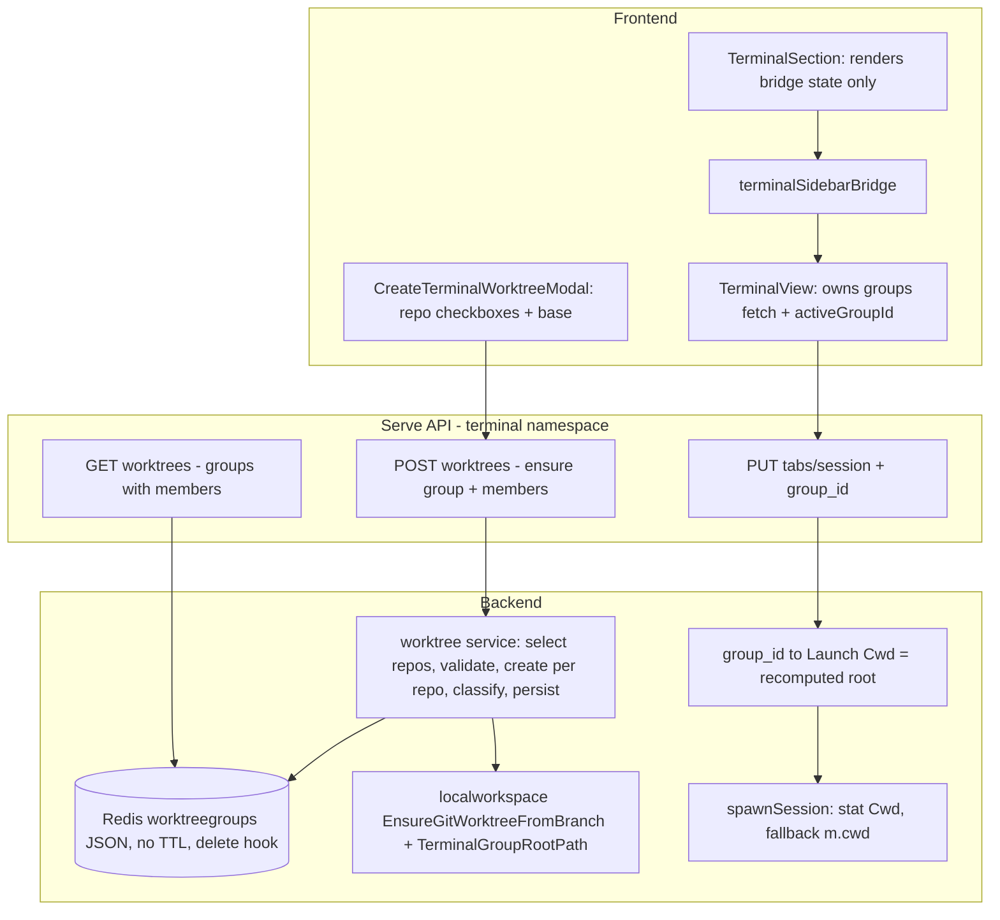

# Terminal Worktree Groups

**Status:** design proposal for review — adversarially reviewed 2026-07-01, findings folded in
**Date:** 2026-06-29
**Scope:** Web UI TERMINALS sidebar + serve API + tab metadata, multi-repo aware.

## Purpose

Evolve the TERMINALS sidebar
(`internal/webui/frontend/src/components/WorkspaceTree/TerminalSection.tsx`)
from a flat tab list into a grouped hierarchy that works in **multi-repo
workspaces**:

- **Default group** (always present, non-deletable): workspace-scoped. Label =
  workspace name, cwd = the **workspace root** (which already contains every
  repo as a subdirectory). Every existing or un-grouped tab lands here.
- **Worktree groups**: a group is a **branch realized as one git worktree per
  selected repo**, all gathered under a single **group root** directory. A
  terminal in the group starts at that root and sees every repo's
  feature-branch checkout as a subdirectory — a parallel workspace root, on a
  feature branch.

The feature surfaces, per repo, **which branch its worktree starts from**, both
at creation (a pre-filled field in the modal) and afterward (a summary line in
the sidebar).

## Core model

A multi-repo workspace root `{ws}/` is a plain directory containing each repo as
a subdir (`{ws}/loomcli`, `{ws}/api`), and the default group's terminal starts
there and sees them all. A worktree group mirrors that shape exactly — a **group
root** containing one worktree per selected repo, all on branch `name`:

```
Group  = { id, name (= branch), root, members[1..N], createdAt }
  root   = {ws}/.loom/terminal-worktrees/{name}          // the terminal cwd
  Member = { repoName, path, baseBranch, baseDetached }   // path = root/{repoName}
Tab    = { ..., worktree_group_id }                       // cwd = group root
```

Because the terminal always starts at the **group root**, selecting N repos just
changes how many repos sit under the root:

| You select… | Result |
|---|---|
| one repo | group root contains one repo's worktree (`cd` into it, or work above it) |
| several repos | group root contains each repo's worktree on the shared branch |
| (later, optional) | a per-repo "open terminal in {repo}" shortcut that starts inside one member instead of the root |

There is **no** "primary repo", **no** per-tab repo selector, and **no** 3-level
tree — a tab carries only `worktree_group_id`. Members are display + bookkeeping
metadata (which repos, each base).

## Architecture



## Verified facts driving the design

- **Multi-repo layout:** each repo is checked out at `{ws.Path}/{repoName}`
  (`localworkspace.RepoPath`, `storeadapter.go:144-147`). The workspace root is a
  single cwd from which all repos are visible — the default group's cwd, and the
  shape the group root mirrors.
- **Group root is isolated from the agent namespace.** Agent worktrees live at
  `{ws}/worktrees/{repoName}/{name}` and the discovery scan only iterates
  `ws.Repos` and reads `worktrees/{repoName}/*` (`worktree_resolve.go:248-269`).
  `{ws}/.loom/` has solid workspace-level prior art (`.loom/logs`
  `server_workspace.go:108`, `.loom/events` `:195`, `TaskRunWorktreePath`
  `localworkspace.go:45-67`) and is protected from daemon cleanup
  (`ProtectedRuntimePaths`, `daemon_runtime.go:130-134`). Repo discovery is
  store-driven, not a workspace-root disk scan. No `loom monitor` phantom rows.
- **Git worktree admin ids don't collide across groups** sharing a repo leaf
  name (`feature-a/loomcli` + `feature-b/loomcli`): git dedupes admin dirs
  (`loomcli`, `loomcli1`); the porcelain parser keys on paths
  (`git_deps.go:208-229`). Verified empirically.
- **Creation helper:** `localworkspace.EnsureGitWorktreeFromBranch(repoPath, targetPath, branchName, remoteName, defaultBranch)`
  (`localworkspace.go:148`) — idempotent (`.git` exists -> skip), two-attempt
  (new branch `-b`, else check out existing), `defaultBranch==""` -> fork HEAD
  no fetch; **non-empty `defaultBranch` fetches and PREFERS `origin/<branch>`
  over the local ref** (`resolveFreshBaseRef`, `localworkspace.go:176-203`).
  Returns generic errors and returns nil for both fresh-create and idempotent
  skip — the caller must pre-stat to distinguish and must classify errors.
- **Launch-spec resolution gate:** `launchSpecForTerminalSession` uses a
  persisted `Launch` only when `len(Argv) > 0 || len(Env) > 0`
  (`ws.go:396`) — a Cwd-only Launch is silently dropped today. `ArgvForSession`
  returns nil for any session not named `lead-*` (`session_command.go:62-88`),
  and such sessions exist (duplicated tabs get `{base}-N` names,
  `terminalTabUtils.ts:150-175`).
- **PUT/attach race is permitted by design:** the backend explicitly allows tab
  metadata PUT to race the first WebSocket attach (`service_tabs.go:113-126`),
  and the frontend currently creates tabs fire-and-forget then mounts
  immediately (`TerminalView.tsx:630-643`) — so a spawn can happen before the
  group id/Launch is persisted.
- **No background GC** removes anything under the workspace (`selfheal.go` only
  reads/binds; `git worktree remove` is only create-rollback + explicit
  `loom workspace remove`, which `os.RemoveAll`s `{ws.Path}` — sweeping
  `.loom/terminal-worktrees/` too). Workspace **delete** does not clean sibling
  Redis stores today (`wrapWorkspaceDeleteFn`, `server_workspace.go:65-104`) —
  issuetabs self-cleans via TTL; a no-TTL store needs an explicit hook.
- **Layering:** webui packages must not import `internal/cli`
  (rule documented in `storeadapter/selfheal.go`); `cli.IsGitLinkedWorktree`
  therefore can't be called from the new service as-is.
- **PTY cwd:** `spawnSession` assigns `cmd.Dir = launch.Cwd` with no stat
  (`pty_manager.go:363-366`). Default/un-grouped tabs run at workspace root via
  `m.cwd` (`multi_pty_manager.go:294`); plain-lead PUT today leaves
  `Launch = nil` (`tabs.go:161-170`). `EnsureSession`'s only caller is CLI-setup
  sessions (`service_setup.go:196`) — `spawnSession` is the single spawn
  chokepoint.
- **No "is_local" flag** on the store path (`IsLinkedWorktree` left zero in
  `storeadapter.loadRepos`). `RepoInfo.current_branch`/`default_branch` already
  exist client-side, so base pre-fill needs no new endpoint.

## Locked decisions

| # | Decision | Rationale / revisit-if |
|---|----------|------------------------|
| D1 | Worktree creation = `localworkspace.EnsureGitWorktreeFromBranch`; new `localworkspace.TerminalGroupRootPath(wsPath, name)` helper (member path = `root/{repo}`); move `validateNewWorktreeName` -> `localworkspace.ValidateWorktreeName` **and** `cli.IsGitLinkedWorktree` -> `localworkspace.IsGitLinkedWorktree` (webui may not import `internal/cli`). Do **not** reuse `AgentWorktreePath` or extract `createSingleWorktree`. | Server-safe helpers in one layering-legal package; CLI re-imports both. |
| D2 | **Path = `{ws.Path}/.loom/terminal-worktrees/{name}/{repo}`; terminal cwd = the group root.** `TerminalGroupRootPath` includes a containment check (mirror `TaskRunWorktreePath`'s `PathContains`, `localworkspace.go:63`). | Name-first root mirrors the workspace root; `.loom/` isolation verified clean (scanner, monitor, daemon cleanup, selfheal). Revisit -> `worktrees/{name}/{repo}` only if a visible path is worth the repo-added-later collision edge. |
| D3 | **Group identity = branch name**, unique per workspace. Creating an existing name is **rejected with 409 "group already exists"** — no merge/ensure semantics — and **create is all-or-nothing**: any per-repo failure rolls back everything the request created and persists nothing. **Consequence: group names share branch-name syntax limits — `/` is rejected, so `feature/auth`-style names are unsupported in v1.** | No duplicate groups and no implicit mutation of an existing group. Adding repos to an existing group is out of scope for v1 (delete/recreate when delete lands). Verified clean against publish/PR flows. |
| D4 | A group = **1..N members** under the group root; members are display/bookkeeping; **tabs carry only `worktree_group_id`**. | Terminal-at-root removes primaryRepo and per-tab repo selectors. |
| D5 | **Base branch:** optional single `base`. **Empty -> fork each repo from its LOCAL current HEAD — call the helper with `defaultBranch=""` (no fetch)** and use `rev-parse` only to *record* `BaseBranch` (detached -> short SHA + flag). Provided -> pass `base` as `defaultBranch` (fetch `origin/base`, local fallback). | Passing the resolved current branch as `defaultBranch` would silently prefer `origin/<branch>` and drop unpushed local commits (`localworkspace.go:193`) — contradicting "forks from its current branch". The `""` path is the correct local-HEAD semantics. |
| D6 | **Default group `__workspace__`** cwd = workspace root (`Launch = nil`); synthetic, synthesized on the frontend. | Existing un-grouped tabs already run at workspace root. |
| D7 | **Store** = single per-workspace JSON doc, **NO TTL**, per-workspace in-process mutex around ensure+persist; **plus a workspace-delete hook** that removes the key. | Small N, atomic. The mutex is in-process only — acceptable for v1's one-serve-per-`LOOM_CONFIG_DIR`; multi-process CAS (WATCH) is out of scope. Desktop-vs-dev-serve (separate Redis, shared disk): the other process's on-disk worktrees are **adopted** at create (branch-match pre-check) rather than duplicated or errored. |
| D8 | **Errors** via `handler.HandleServiceError`; classify git stderr **per repo**; **partial success allowed** with per-repo status. `results` are returned on **every** outcome, including full failure. | Multi-repo create must not be all-or-nothing, and per-repo messages matter most when everything failed. |
| D9 | **Local-repo filter**: `Path != ""` + `os.Stat(Path/.git)` + **not** `localworkspace.IsGitLinkedWorktree(Path)`. Default selection = all local repos. | No prebuilt helper; locality checked in the service (layering-legal after D1's move). |
| D10 | **PTY robustness:** `spawnSession` stats `launch.Cwd`, falls back to `m.cwd` when missing. | Group root deleted out-of-band degrades gracefully; also hardens agent tabs. |
| D11 | **Ordering: for non-default groups the frontend AWAITS the metadata PUT before mounting the tab / opening the WebSocket.** Default-group tabs keep today's fire-and-forget. | The backend permits the PUT/attach race (`service_tabs.go:113-126`); without ordering, the first spawn wins the race and the shell lands at the workspace root while the sidebar shows it in the group. The PUT is a local Redis write — awaiting it is cheap. |
| D12 | **Honor Cwd-only Launch:** widen `launchSpecForTerminalSession`'s condition (`ws.go:396`) to also accept a persisted Launch whose `Cwd` is non-empty (Argv/Env may be empty -> default shell). The agent-tab guard at `:387-394` is untouched. | Without this, any non-`lead-*` session (e.g. duplicated tabs) silently loses its group cwd — `ArgvForSession` returns nil for those names. |
| D13 | **`Launch.Cwd` is recomputed at PUT time** from `TerminalGroupRootPath(ws.Path, group.Name)`, not read from the stored `Root` (which is informational only). | Immune to workspace path re-binds (self-heal): a stale stored root would otherwise silently dump terminals at the workspace root via D10's fallback. |

## Backend changes

### B1. Shared helpers (`worktree-create-shared`)

- Move `validateNewWorktreeName` -> `localworkspace.ValidateWorktreeName(name)`.
  Keep existing rejections (empty, leading `-`, `.`/`..`, embedded `..`,
  `/ \ : * ? " < > |`). **Add:** reserved `__workspace__` (case-insensitive),
  all-whitespace, over-length (cap ~100), and git-ref-invalid patterns the old
  validator missed (`~`, `^`, `?`, `*`, `[`, `@{`, leading/trailing `.`,
  trailing `.lock`, consecutive dots). CLI `init_helpers.go` imports it back.
- Move `cli.IsGitLinkedWorktree` (`internal/cli/worktree.go:27-33`) ->
  `localworkspace.IsGitLinkedWorktree`; CLI re-exports/imports it back.
- Add `localworkspace.TerminalGroupRootPath(wsPath, name) (string, error)`
  returning `{wsPath}/.loom/terminal-worktrees/{name}` **with a containment
  check** (mirror `TaskRunWorktreePath`'s `PathContains`).
- Add a **context-aware variant** of the git runner for worktree creation
  (`EnsureGitWorktreeFromBranchCtx` using `exec.CommandContext`), so the service
  can impose a per-repo timeout — `runGit` today is context-free
  (`localworkspace.go:205-213`) and a black-holing remote would hang the HTTP
  handler indefinitely.

### B2. Worktree group store (`worktree-group-store`)

New package `internal/webui/worktreegroups`, mirroring `issuetabs/store.go`'s
shape (JSON blob per key) but **without TTL**:

```go
type WorktreeGroupMember struct {
    RepoName     string `json:"repo_name"`
    Path         string `json:"path"`          // = root/{repoName}
    BaseBranch   string `json:"base_branch"`   // branch or short SHA it forked from; "" when an existing branch was reused
    BaseDetached bool   `json:"base_detached"`
    ReusedBranch bool   `json:"reused_branch"` // branch pre-existed; no fresh fork happened
}

type TerminalWorktreeGroup struct {
    ID        string                `json:"id"`    // uuid; "__workspace__" reserved, never stored
    Name      string                `json:"name"`  // == branch
    Root      string                `json:"root"`  // informational; cwd is recomputed (D13)
    Members   []WorktreeGroupMember `json:"members"`
    CreatedAt time.Time             `json:"created_at"`
}
```

- Key `terminal:worktreegroups:{workspace}` -> JSON `[]TerminalWorktreeGroup`.
- `List(ws)`, `Get(ws, name)`, `Add(ws, group)` (**fails if the name already
  exists**), `DeleteWorkspace(ws)` — read-modify-write under a per-workspace
  in-process `sync.Mutex` (D7).
- Constructed in `appstores.go` (`InitWorktreeGroups`, mirror
  `InitIssueTabs:90-97`).
- **Workspace-delete hook:** extend `wrapWorkspaceDeleteFn`
  (`server_workspace.go:65-104`) to call `DeleteWorkspace(ws)` — a no-TTL store
  would otherwise leak permanently, and a re-created workspace reusing the key
  (`workspace_impl.go:377-384` accepts name-keys) would resurrect groups whose
  roots point at deleted paths.

### B3. Worktree service + API (`worktree-service-api`)

**Service:**

1. **Resolve candidate repos**; **filter to local** per D9.
2. **Repo selection:** `req.repos` if provided (validate each is local), else
   **all local repos**. Empty selection -> `ErrValidation`.
3. **Validate name:** `ValidateWorktreeName`.
4. `root := TerminalGroupRootPath(ws.Path, name)`.
5. **Duplicate check (D3):** `Get(ws, name)` under the per-workspace mutex
   (held for the whole create) -> exists ->
   `service.ErrConflict("worktree group 'X' already exists")` (**409**),
   before anything touches disk.
6. **Per repo** (attempt every repo so `results` are complete; per-repo
   context timeout, e.g. 60s):
   - **Pre-checks:** `target/.git` exists -> **adopt** it only when its
     checked-out branch == `name` (`git -C target rev-parse --abbrev-ref
     HEAD`), status `exists` — crash-recovery for a killed mid-create request
     or the other serve process (desktop vs dev, shared disk); wrong branch ->
     per-repo `error`. If `target` exists **without** `.git` -> remove it when
     empty, else per-repo `error` "target path is occupied" (never feed it to
     the helper — the "already exists" stderr mis-matches its branch-conflict
     retry, `localworkspace.go:230-238`, and retries would wedge forever).
     Pre-check `git rev-parse --verify refs/heads/{name}` -> branch pre-exists
     means the add will *reuse* it: record `ReusedBranch`, `BaseBranch=""` —
     and remember which branches this request creates, for rollback.
   - **Base:** `base` empty -> `defaultBranch=""` (fork local HEAD, no fetch —
     D5) and record `BaseBranch` from `rev-parse --abbrev-ref HEAD`
     (`HEAD` -> short SHA + `BaseDetached`). `base` provided -> pass as
     `defaultBranch`; reject `base == name` -> per-repo error.
   - `EnsureGitWorktreeFromBranchCtx(ctx, repo.Path, target, name, "", defaultBranch)`.
   - **Classify:** `already used by worktree`/`already checked out` ->
     `conflict`; `already exists` (path collision) -> `error` "target path
     occupied"; `fetch base branch`/base missing -> `error`; other git failure
     -> `error` with trimmed stderr; nil -> `created` / `reused` per pre-checks.
7. **All-or-nothing (D3):** every repo ended `created|exists|reused` ->
   `Add` the group -> **201**. Any repo failed -> **roll back**:
   `git worktree remove --force` each worktree this request created,
   `git branch -D {name}` in repos where this request created the branch
   (reused/pre-existing branches are kept), remove the root dir if empty;
   adopted (`exists`) members are left untouched. Persist nothing; return 4xx
   with complete per-repo `results` (rolled-back repos -> `rolled_back`).
8. **Persist failure after git success:** roll back the same way -> 500. The
   all-or-nothing invariant holds; only a crash mid-request can orphan
   worktrees, which the adopt pre-check remediates on retry.

**Handlers** (new `internal/webui/handlers/terminal/worktrees.go`):

- `HandleListWorktreeGroups` -> `{ groups: [...] }`.
- `HandleCreateWorktreeGroup` -> `handler.ReadJSON`; **201** on success — the
  only success shape (create is all-or-nothing); **409** when the group name
  already exists; any-repo failure -> 4xx via `handler.HandleServiceError`
  **plus `results`** in the body. Mixed-failure aggregation: `conflict` wins
  over `error` for the envelope's kind.
- Register under `/api/workspaces/{ws}/terminal/worktrees` in `tab_module.go`
  (`middleware.WorkspaceFromContext`). OpenAPI schemas in `api/openapi.yaml`.

**Sibling change:** hide `.loom` from the workspace file browser at workspace
scope — `hiddenScopeSegments` currently hides only `.git`
(`svcimpl/file_service.go:210`), so every group's full checkout would appear in
the read-only viewer as duplicate trees.

### B4. Tab metadata: group + cwd (`tab-group-cwd`)

- Add `WorktreeGroupID string` (`json:"worktree_group_id,omitempty"`) to
  `tabmeta.TabMetadata`; wire through `Set` (`store.go:240-266`),
  `parseMetadata` (`store.go:422+`), and GET list/get.
- `tabPutRequest` (`tabs.go:129`): add `WorktreeGroupID`.
- **Resolution in `HandlePutTerminalTab`** (never trust client `Cwd`):
  - `gid == "" || gid == "__workspace__"` -> `Launch = nil`; store
    `__workspace__`.
  - else look up the group: **not found** -> fall back to `__workspace__`,
    `Launch = nil`, log; **found** ->
    `Launch = &LaunchSpec{ Cwd: TerminalGroupRootPath(ws.Path, group.Name), Argv: ArgvForSession(session) }`
    (cwd **recomputed**, D13; `Argv` may be nil -> default shell per D12).
- **`ws.go:396` (D12):** widen the persisted-Launch acceptance to
  `len(Argv) > 0 || len(Env) > 0 || Cwd != ""`. Agent-tab precedence
  (`:387-394`) unchanged.
- **Duplicated tabs inherit the source tab's `worktree_group_id`**
  (`useTabActions.ts:109` passes it through) — their `{base}-N` session names
  produce nil Argv, which D12 makes work (default shell at the group root).
  Other `createTab` callers (`useTabInit.ts:166`, `useSessionSeeding.ts:107`)
  pass nothing -> default group, unchanged behavior.
- Migration: empty `worktree_group_id` on existing tabs -> `__workspace__`.

### B5. PTY cwd fallback (`pty-cwd-fallback`)

In `spawnSession` (`pty_manager.go:363-366`), stat `launch.Cwd` before
assigning; if not an existing dir, keep `m.cwd` and log a warning. Single spawn
chokepoint (verified — `EnsureSession`'s only caller is CLI-setup sessions);
mirrors `agentLaunchCwd` (`agent_session.go:338-358`).

## Frontend changes

### F1. API + bridge (`frontend-api-bridge`)

- `src/api/terminal/worktrees.ts`: `listTerminalWorktrees(ws)`,
  `createTerminalWorktree(ws, { name, repos?, base? })`.
- `terminal.ts`: add `worktree_group_id?` to `TabMetadata`, and **explicitly**
  add it to the `createTab` PUT body object (`useTerminalMetadata.ts:126-132`) —
  the body is a hand-picked field set and `putTabMetadata` casts to `any`, so an
  unset field is silently dropped.
- `useTerminalMetadata.createTab(session, label, sortOrder, worktreeGroupId?)`.
- Extend `terminalSidebarBridge.ts`:

  ```ts
  interface TerminalWorktreeMember {
    repoName: string; baseBranch?: string; baseDetached?: boolean; reusedBranch?: boolean
  }
  interface TerminalWorktreeGroup {
    id: string; label: string; isDefault?: boolean
    members: TerminalWorktreeMember[]   // [] for default group
  }
  interface TerminalSidebarTab { /* existing */ groupId: string }
  interface TerminalSidebarState {
    groups: TerminalWorktreeGroup[]; tabs: TerminalSidebarTab[]
    activeTabId: string; activeGroupId: string
  }
  ```

  New events: `TERMINAL_SIDEBAR_ACTIVE_GROUP_EVENT` +
  `requestTerminalGroupSelect(groupId)`;
  `TERMINAL_SIDEBAR_WORKTREES_CHANGED_EVENT` **whose detail carries the created
  group object** (so the owner can insert it without a refetch race); change
  `requestTerminalNewTab()` -> `requestTerminalNewTab(groupId)` (1 real caller,
  `TerminalSection.tsx:91`).

### F2. TerminalSection UI (`terminal-section-ui`)

**Ownership rule: TerminalSection renders bridge state only — it does NOT fetch
groups.** (TerminalView owns the data; see F3. A second fetcher here would race
the publisher and mis-validate `activeGroupId`.)

- Add `useWorkspaceContext()` (net-new here) for workspace name + `repos`
  (needed by the modal and the default-group label).
- Render **collapsible 2-level group blocks** from `state.groups`, building the
  chevron + collapse fresh (copy the `>` span + `.collapseChevron` from
  `WorkspaceTree.module.css:784-802`; `AgentSection`'s `.subgroup*` are static
  containers, no collapse):
  - Group header = `name`; muted **member summary** —
    `loomcli ← main · api ← develop` ("(detached)" / "existing branch" per
    member as flagged).
  - Default group header = workspace name,
    `data-testid="terminal-group-workspace"`, no member summary.
  - Terminal rows (existing `TerminalRow`) + one `+ New terminal` per group ->
    `requestTerminalNewTab(groupId)`.
- Section footer `+ New worktree` -> modal (disabled when **no local repos**).

`CreateTerminalWorktreeModal.tsx` (reuse `AetherModal`; form is net-new —
`AddRepoModal` is two free-text inputs, not a picker):

- **Worktree name** (required) -> the branch. Note in helper text: no `/` in
  names (v1 limitation, D3).
- **Repos**: checkboxes of **local non-linked repos** from context (default all
  checked), each showing its `current_branch`.
- **Base branch** (free text, optional): empty -> each repo forks from its own
  local HEAD; set -> fork all from `origin/<base>` (local fallback).
- On submit: call the API; show **per-repo results**
  (created / exists / reused / conflict / error / rolled_back). Failure (incl.
  409 name-already-exists) -> keep open with `{error, kind}` + per-repo
  messages; success -> dispatch
  `TERMINAL_SIDEBAR_WORKTREES_CHANGED_EVENT` **with the group object in
  detail**, then `requestTerminalGroupSelect(group.id)`.

### F3. TerminalView integration (`terminal-view-wire`)

**TerminalView owns group data**: fetch on mount (when `isActive`), on
workspace change, and on `TERMINAL_SIDEBAR_WORKTREES_CHANGED_EVENT` (inserting
the event's group object immediately — no refetch needed for the create path).

- Own `activeGroupId`, seeded from
  `scopedStorage.wsGet(workspaceId, SK_TERMINAL_ACTIVE_GROUP)` default
  `"__workspace__"`. **Validation timing:** only reset a stale id to
  `__workspace__` **after the groups fetch has settled** — never before (a
  persisted valid id must not be clobbered by validating against a
  not-yet-loaded list; the PUT path degrades safely server-side meanwhile). On
  **workspace switch** (no remount): re-read, re-fetch, validate after settle.
- Publish `{ groups, tabs: visibleTabs.map(t => ({ ..., groupId: t.worktree_group_id || "__workspace__" })), activeTabId, activeGroupId }`
  (`TerminalView.tsx:656-672`).
- Listener (`:674-697`): `onNewTab` reads `detail.groupId` (today it discards
  the detail) -> `handleBackendSelect(backend, groupId)`. **For a non-default
  group, AWAIT `createTab(...)` before the optimistic `setTabs`/mount (D11)** —
  today's fire-and-forget (`:630-643`) lets the WS attach spawn the PTY at the
  workspace root before the group cwd is persisted. Default group keeps
  fire-and-forget. Disable the group's `+ New terminal` while the PUT is in
  flight; on PUT failure, surface the error and do not mount.
- Group-select listener sets + persists `activeGroupId` and republishes.

## API contracts

```
GET  /api/workspaces/{ws}/terminal/worktrees
  -> 200 { "groups": [ TerminalWorktreeGroup ... ] }      // user groups only

POST /api/workspaces/{ws}/terminal/worktrees
  body { "name": "feature-auth", "repos"?: ["loomcli","api"], "base"?: "main" }
  -> 201 (all repos succeeded — create is all-or-nothing)
     {
       "group": { id, name, root, created_at,
                  "members": [ { repo_name, path, base_branch, base_detached, reused_branch } ] },
       "results": [ { "repo": "loomcli", "status": "created" }, ... ]
     }
  -> 409 { "error": "worktree group 'X' already exists", "kind": "conflict" }
  -> 4xx (any repo failed; this request's worktrees rolled back, nothing persisted)
     { "error": "...", "kind": "validation|conflict|not_found",
       "results": [ { "repo": "loomcli", "status": "rolled_back" },
                    { "repo": "api", "status": "conflict", "message": "..." } ] }

PUT  /api/workspaces/{ws}/terminal/tabs/{session}
  body adds: "worktree_group_id"?
```

`status` ∈ `created | exists | reused | conflict | error | rolled_back`.

## Edge cases

| Area | Case | Handling |
|------|------|----------|
| Name | reserved `__workspace__`, leading `-`, `..`, path seps, empty/whitespace, over-long, git-ref-invalid (`~ ^ ? * [ @{`, trailing `.lock`, dots) | `ValidateWorktreeName` -> 400 |
| Name | contains `/` (e.g. `feature/auth`) | rejected — **v1 limitation**, stated in modal helper text |
| Name | `base == name` (for a repo) | per-repo `error`; other repos may still succeed |
| Repos | `repos` omitted | select **all local** repos |
| Repos | named repo not local / no `.git` / linked-worktree | excluded; if explicitly named -> per-repo `error` |
| Repos | no local repos at all | service -> **400**; FE disables `+ New worktree` |
| Create | POST with an existing group name | **409 "group already exists"** before anything touches disk (D3) |
| Create | branch `name` pre-exists locally, not checked out | pre-check detects -> add reuses it -> status **`reused`**, `BaseBranch=""` (no false fork claim); kept on rollback |
| Create | branch checked out elsewhere (another worktree / an agent) | per-repo **conflict** -> whole create rolls back |
| Create | `target/.git` already exists (crash leftover / other-process create) | **adopt** when its checked-out branch == `name` -> `exists`; wrong branch -> per-repo `error` |
| Create | `target` exists **without** `.git` (killed mid-create) | remove if empty, else per-repo `error` "target path occupied" — **never** fed to the helper (its `already exists` matcher would mis-retry and wedge every retry) |
| Create | **any repo fails** | **all-or-nothing**: this request's worktrees removed (`git worktree remove --force`) + fresh branches deleted (reused/adopted kept), root removed if empty, nothing persisted; 4xx + complete `results` incl. `rolled_back` |
| Create | retry after a failed create | clean slate (rollback ran); crash leftovers are adopted via the branch-match pre-check |
| Create | git ok, Redis persist fails | roll back the same way; 500 (all-or-nothing invariant holds) |
| Create | remote hangs during fetch | per-repo context timeout (B1 ctx runner) -> per-repo `error` |
| Base | `base` omitted | fork **local HEAD** (`defaultBranch=""`, no fetch — D5); record current branch / short SHA (detached) |
| Base | `base` provided | fetch `origin/base`, fork fresh; local fallback offline; not found -> per-repo `error` |
| Tab cwd | default group | `Launch = nil` -> workspace root |
| Tab cwd | group deleted / unknown id | fall back to `__workspace__`, log |
| Tab cwd | non-`lead-*` session (duplicated tab etc.) | Cwd-only Launch honored via **D12** (`ws.go:396` widened); default shell at group root |
| Tab cwd | workspace path re-bound (self-heal) | cwd recomputed at PUT time (**D13**); stored root refreshed on ensure |
| Race | createTab PUT vs first WS attach | **D11**: FE awaits PUT for group tabs before mounting; backend keeps permitting the race for default tabs (`service_tabs.go:113-126`) |
| Tabs | duplicate a group tab | inherits `worktree_group_id` (`useTabActions.ts:109`) |
| Tabs | other createTab callers (`useTabInit`, `useSessionSeeding`) | pass no group -> default group, unchanged |
| Runtime | group root deleted out-of-band, then attach/respawn | D10: stat `Cwd`, fall back to `m.cwd` |
| Runtime | live PTY + PUT replace | `service_tabs.go` rejects replace on live PTY -> group is create-time only |
| Runtime | global `MAX_TABS` cap | stays global in v1 |
| Namespace | `.loom/terminal-worktrees/` | invisible to agent scanner + `loom monitor`; protected from daemon cleanup; **hidden from the workspace file browser** (B3 sibling change) |
| Namespace | workspace **delete** | delete hook removes the Redis key (no-TTL store must not leak / resurrect on key reuse); `os.RemoveAll(ws.Path)` sweeps the worktrees |
| Store | two serve processes / desktop-vs-dev split (shared disk) | in-process mutex only — documented v1 limitation (D7); the other process's worktrees are adopted at create via the branch-match pre-check |
| FE | `activeGroupId` stale / wrong workspace | validate **only after groups fetch settles** -> reset to `__workspace__` |
| FE | group created in modal, selected immediately | worktrees-changed event carries the group object; owner inserts synchronously — no deselection race |
| FE | workspace switch (no remount) | re-read + re-fetch + validate-after-settle |
| FE | `requestTerminalNewTab` missing groupId | default to current `activeGroupId`, else `__workspace__` |
| FE | group fetch fails | render default group only; surface error; don't block sidebar |
| FE | empty group | still render with `+ New terminal` |
| Existing | pre-feature tabs (no group id) | migrate to default group at read time |
| Tests | `TerminalSection.test.tsx` asserts old bridge shape | **update**, not just add |

## Tests

| File | Covers |
|------|--------|
| `localworkspace` tests | validate: reserved, length, flag-injection, traversal, git-ref-invalid chars; `TerminalGroupRootPath` shape + containment; `IsGitLinkedWorktree` post-move; ctx runner timeout |
| `worktreegroups` store test | add/list/get; `Add` fails on an existing name; concurrent create under mutex (second gets conflict); `DeleteWorkspace` |
| `handlers/terminal/worktrees_test.go` | all-local default; explicit subset; single/multi-repo under one root; **same-name create -> 409 before disk is touched**; **any-repo failure -> rollback** (created worktrees gone, fresh branches deleted, reused branches kept, empty root removed, nothing persisted) + 4xx with complete `results` incl. `rolled_back`; persist failure -> rollback + 500; crash-leftover worktree on branch `name` -> adopted (`exists`), wrong branch -> `error`; pre-existing branch -> `reused` + `BaseBranch=""` + kept on rollback; occupied non-`.git` target -> removed-if-empty / `error`-if-not (and **not** wedged on retry); base omitted forks **local HEAD** (unpushed commits present in worktree); base provided fetches; detached -> SHA + flag; `base == name` |
| `handlers/terminal/tabs_test.go` | PUT default -> `Launch = nil`; PUT group -> Cwd recomputed from ws.Path (not stored root); PUT unknown group -> fallback; `ws.go` D12: Cwd-only Launch honored for non-`lead-*` sessions, agent-tab precedence untouched |
| `terminal/pty_manager_test.go` | spawn with missing `Cwd` falls back to `m.cwd` |
| `terminalSidebarBridge` test | new payloads incl. members + per-tab `groupId` + `activeGroupId`; worktrees-changed detail carries group |
| `TerminalSection.test.tsx` | renders from bridge state only (no fetch); 2-level render; member summary incl. detached/reused; events; repo checkboxes; per-repo `current_branch` hint; per-repo result display incl. partial + all-fail; active-group highlight |
| `TerminalView.test.tsx` | owns fetch; `createTab` **awaited** before mount for group tabs (D11) and fire-and-forget for default; PUT failure -> no mount + error; `onNewTab` reads `detail.groupId`; duplicate tab inherits group; activeGroupId persisted + validated only after fetch settles + workspace-switch re-read; create-event group inserted without refetch |

## Implementation tasks

1. **worktree-create-shared** — `ValidateWorktreeName` (+git-ref rules) +
   `TerminalGroupRootPath` (containment) + `IsGitLinkedWorktree` move into
   `internal/localworkspace`; ctx-aware `EnsureGitWorktreeFromBranchCtx`.
2. **worktree-group-store** — Redis JSON store `internal/webui/worktreegroups`
   (no TTL, per-ws mutex, root + members incl. `reused_branch`); wire
   `appstores.InitWorktreeGroups`; **workspace-delete hook**.
3. **worktree-service-api** — service (local filter, selection,
   **duplicate-name 409**, pre-checks: adopt-or-error on leftover worktrees /
   occupied-target remediation / branch pre-existence, base per D5, per-repo
   ctx timeout, classify, **all-or-nothing rollback**, persist) + handlers
   (201-only success, results always) + routes + OpenAPI; **hide `.loom` in the
   workspace file browser** (`file_service.go:210`).
4. **tab-group-cwd** — `worktree_group_id` through tabmeta
   (`store.go:240/266/422`); PUT resolution with **recomputed** cwd (D13);
   **widen `ws.go:396`** (D12); duplicated tabs inherit group id.
5. **pty-cwd-fallback** — stat `launch.Cwd` in `spawnSession`, fall back to
   `m.cwd`.
6. **frontend-api-bridge** — `worktrees.ts` client; `worktree_group_id` in FE
   `TabMetadata` + `createTab` body; bridge extensions (groups w/ members,
   per-tab `groupId`, `activeGroupId`, group-select, worktrees-changed **with
   group payload**, `requestTerminalNewTab(groupId)`).
7. **terminal-section-ui** — render-only 2-level `TerminalSection` (chevron
   fresh; `useWorkspaceContext`; member summary) + `CreateTerminalWorktreeModal`
   (repo checkboxes + per-repo branch hint, base field, per-repo results incl.
   all-fail; gate when no local repos; name helper text re `/`).
8. **terminal-view-wire** — `TerminalView` owns groups (fetch + event-insert);
   `activeGroupId` lifecycle (validate-after-settle, workspace switch); publish;
   **awaited** `createTab` for group tabs (D11) with in-flight/disabled + error
   states.
9. **tests** — per the Tests table.

## Out of scope (v1)

Drag terminals between groups; delete/rename groups or members; **adding repos
to an existing group** (no ensure/merge — delete/recreate once delete lands);
reassigning a tab's group via PATCH (the `patchTabMetadata` `Pick` whitelist
would need widening); auto-syncing groups from discovered worktrees; a branch-list dropdown
for base (free text pre-filled from `current_branch`); group names containing
`/` (branch-path names); a per-repo "open terminal inside {repo}" shortcut;
auto-`cd`-ing single-member groups into their lone repo; multi-process store
CAS (in-process mutex only, one serve per `LOOM_CONFIG_DIR`).
