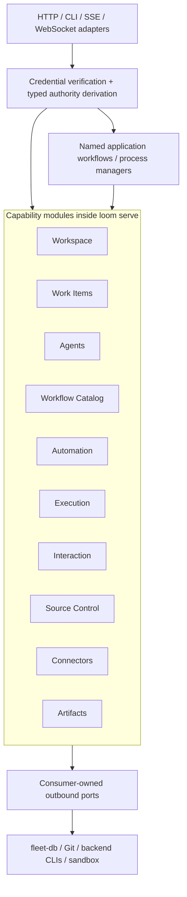

# Target Architecture and Capability Boundaries

- **Status:** Proposed
- **Scope:** In-process ownership and dependencies inside `loom serve`, operator CLI transport behavior, and corresponding frontend feature boundaries
- **Migration:** [Modular Monolith Migration](README.md)

## Capability map

The initial target has ten product capabilities. A capability is deliberately coarse: it is a package cluster, product-aggregate ownership boundary, and change boundary—not one package per noun. Named process managers may additionally own durable coordination records, but never participating product aggregates.

| Capability | Owns | Explicitly does not own |
|---|---|---|
| **Workspace** | Workspace and repository catalog, workspace-local configuration | Git/worktree mechanics, agents, runs |
| **Work Items** | Issue/task lifecycle, dependencies, status vocabulary, comments, issue-journal semantics | Run claims, worker leases, workflow scheduling |
| **Agents** | Durable Agent identity (current `AgentService` shape), Role, behavior reference, desired state, AgentOwnershipLease, agent-service lease instances | Sessions, PTYs, Git operations, trigger matching, process spawning |
| **Workflow Catalog** | Driver, DriverVersion, source build, immutable versioning, approval, activation, effective trust | Trigger matching and run lifecycle |
| **Automation** | TriggerBinding, Event, Delivery, cron/webhook ingestion, actor/hop/idempotency admission | Workflow execution, issue mutation, interactive sessions |
| **Execution** | DriverRun, DriverStep, TaskRun, TaskRunEvent, ActionLedger, Node/Worker/WorkerProfile, run claims/leases, fencing, awaits, retries, recovery, sandbox/runtime placement | Trigger matching, workflow authoring, interactive session lifecycle |
| **Interaction** | AgentSession, TerminalSession, AgentLease, terminal lease instances, inbox/outbox delivery, chat runtime, PTY lifecycle, session transcript linkage | Agent identity, batch-run lifecycle, Git publishing |
| **Source Control** | Git, checkout/worktree materialization, diffs, stack lineage/publication, PR operations | Workspace catalog, credential vault, agent identity |
| **Connectors** | Connector definitions, grants, vault references, provider dispatch, call audit | General authentication, workflow approval, workspace catalog |
| **Artifacts** | Artifact metadata/content lifecycle, upload lease instances, finalization, checksums, visibility, redaction, durable references | Producing run/session lifecycle and activity aggregation |

Activity, history, usage, and observability are read projections—not another write-owning capability. Execution and Interaction create artifacts through the Artifacts API and retain only durable references.

## Aggregate ownership

| Record or invariant | Sole write owner | Cross-capability rule |
|---|---|---|
| Workspace, Repository | Workspace | Source Control receives references; it does not rewrite catalog records |
| Issue, dependency, status, comment | Work Items | Execution requests claim/finish through an explicit atomic fleet-db command |
| Agent, Role, desired state, AgentOwnershipLease | Agents | Other capabilities retain IDs or immutable projections only |
| Driver, DriverVersion, trust state | Workflow Catalog | Automation resolves an activated version through the catalog API |
| TriggerBinding, Event, Delivery | Automation | Webhooks enter only Automation ingestion |
| DriverRun, DriverStep, TaskRun, TaskRunEvent, Node/Worker/WorkerProfile, run Lease, Await | Execution | Automation requests execution and consumes durable outcomes; Execution never imports Automation |
| AgentSession, TerminalSession, AgentLease, inbox, current lead-delivery Outbox | Interaction | Session records remain distinct from batch execution records; NodeID is an opaque placement reference |
| Worktree, stack lineage/publication state | Source Control | Workspace owns catalog/configuration; Source Control owns materialization mechanics |
| Connector, Grant, secret/audit state | Connectors | Callers request granted actions; plaintext credentials never cross the public API |
| Artifact | Artifacts | Execution/Interaction request create/finalize and retain references; neither writes Artifact storage directly |
| Generic fleet-db Lease | Per instance: `agent_service` → Agents; `driver_run`/`task_run` → Execution; `terminal` → Interaction; `artifact_upload` → Artifacts | The shared table/API is a concurrency mechanism, not an aggregate owner. Loom exposes only owner-scoped ports; fleet-db validates workspace, discriminator, resource, holder, token, and fence and rejects cross-resource heartbeat/release |
| ActionLedger | Execution | Records idempotent run-side-effect intent/result only. Execution is its sole writer and invokes Work Items or Source Control owner commands for the actual comment/status/PR mutation |
| Activity/history/usage | Read projection only | May combine Execution and Interaction DTOs; never merges their persistence aggregates |
| PlatformEvent/general mutation journal | fleet-db mechanism/read projection | Loom capabilities consume it; no Loom capability writes it as a product aggregate |
| AgentCommand | Interaction, transitional | Retained only while lead/session daemon dependencies exist; task dispatch moves to Execution and the legacy record is then deleted |
| DaemonProfile | Legacy tombstone | No target module; retired with the daemon after parity and dependency removal |
| `<Workflow>ProcessState` | Its named `app/<workflow>` process manager | Coordination only: idempotency key, durable step/retry state, and terminal result; it cannot mirror or mutate a participating aggregate |

`DriverRun` and `AgentSession` intentionally remain different aggregates. They have different identity, payload, lifecycle, and fencing semantics. A shared activity DTO is acceptable; a shared table or generic execution repository is not.

Do not publish one generic Lease abstraction until task-run fencing is normalized. Driver-run fencing uses a monotonic sequence; task-run fencing currently derives from wall-clock nanoseconds. Separate types must state their actual guarantee in the interim.

## Component model



## Dependency rules

1. Cross-capability calls import only another capability's public root API.
2. A capability never imports another capability's adapter, repository, transport, or `internal/` implementation.
3. Public operations express intent—`ApproveVersion`, `DispatchEvent`, `ClaimTask`, `EnsureSession`, `MaterializeWorkspace`—rather than generic CRUD.
4. Outbound ports are defined by the consuming capability and kept narrow.
5. Concrete services are acceptable when substitution is unnecessary. An interface for every struct is not a goal.
6. Direct commands/queries handle synchronous collaboration. Durable fleet-db mutation/outbox/SSE paths handle asynchronous integration; no global in-memory event bus is introduced.
7. Reverse flow uses durable events or read projections, not reverse imports.
8. The checked-in dependency graph is default-deny. A new edge requires reviewing the code and graph change together.

Expected initial direction:

- Source Control may use Workspace references and Connectors action APIs.
- Execution may use public APIs or immutable references from Agents, Work Items, Workflow Catalog, Source Control, Connectors, and Artifacts.
- Automation may resolve Workflow Catalog versions and invoke Execution commands.
- Interaction may use Agents, Work Items, Source Control, Connectors, and Artifacts public APIs. A NodeID remains an opaque Execution placement reference, not permission to mutate Node/Worker state.
- Automation may consume durable Execution outcomes; Execution must not import Automation.
- Inbound webhooks use a named `webhookingestion` workflow: the transport asks Connectors to verify the signature without returning the secret, then calls Automation ingestion. This avoids both a hidden Automation→Connectors repository edge and secret exposure.

Private Git materialization uses a similarly bounded broker seam. Source Control requests a repository- and operation-scoped credential-helper/askpass handle from Connectors; it never receives a standing plaintext credential in a DTO, environment variable, or argv. The helper resolves the secret just in time inside the serve-owned materializer and expires after the bounded Git operation. If an opaque helper cannot be provided safely, Connectors executes the bounded authenticated operation rather than returning plaintext.

Cross-capability user flows belong in specifically named application packages such as `agentprovisioning`, not in handlers, `serve`, or a generic service locator.

## Proposed package shape

```text
internal/
  modules/
    workflowcatalog/
      api.go              # commands, queries, public results
      model.go            # catalog-owned records and invariants
      ports.go            # outbound dependencies needed here
      errors.go
      internal/           # hidden implementation
      fleetdb/            # outbound adapter
      httpapi/            # inbound adapter
    automation/
    execution/
    agents/
    interaction/
    workitems/
    workspace/
    sourcecontrol/
    connectors/
    artifacts/

  app/
    agentprovisioning/    # named multi-capability workflow core + owned ports
      fleetdb/            # composition-only adapter for atomic/coordination commands
    webhookingestion/     # verify via Connectors, ingest via Automation
    serve/                # composition only

  platform/
    authority/
    runtime/
    telemetry/
    config/

  cli/
    workflow/             # authenticated management-API client
    trigger/              # authenticated management-API client
```

Subdirectories are optional. Add them when the capability needs them; do not create empty template layers.

The non-capability roots have explicit restrictions:

- `platform` contains stable mechanisms and imports no product capability.
- `app/serve` may construct public APIs and adapters but owns no business state or policy.
- a named `app/<workflow>` core may call several public capability APIs and its own consumer-defined ports, but it may not import module internals, concrete adapters, or product repositories;
- a named workflow may define an atomic-command or coordination-state port. An app-local `fleetdb` adapter implements that port around the shared transport client, and `app/serve` injects it; the workflow core never imports the adapter;
- a recoverable process manager may own only its coordination record through that port: idempotency key, step state, retry state, and terminal result—not any participating product aggregate;
- neither `app` nor `platform` is an escape hatch for generic domain models or business services.

Standalone mutating CLI commands call the authenticated `loom serve` management API. They do not import capability implementations or construct an authority object locally. Commands that must work without `serve` are limited to local bootstrap/config/file operations and cannot mutate fleet-db product aggregates.

That target is a product/contract change, not an incidental package move. MM-7 must specify how the CLI discovers an endpoint, whether it may start an ephemeral local management host, what happens when no host is available, how local/open mode authenticates, and how scripts and agent child processes migrate. Each command family converts in a separate compatibility slice with explicit old/new behavior and rollback.

Avoid new `common`, `shared`, `models`, `services`, or global repository buckets. Stable primitives such as authority, clock, IDs, and telemetry may be shared only when their semantics are capability-independent.

## Persistence and transaction boundary

`store.Store` may temporarily exist only in composition, compatibility adapters, and tests. Migrated capability logic, HTTP adapters, and CLI adapters must not accept it.

Module-local ports do not mean one repository per entity. Loom cannot create a transaction by sequencing fleet-db HTTP calls. The responsibility split is:

- Loom capabilities own product policy, use-case invariants, and orchestration.
- Fleet-db owns atomicity, compare-and-swap, fencing, persisted preconditions, claims, leases, and durable transitions.
- Transport adapters may repeat validation for useful errors, but neither adapter validation nor a folder boundary is a correctness mechanism.

Every cross-capability mutation must be either:

1. one atomic fleet-db service command, or
2. an idempotent process manager with durable progress/recovery and fault-injection tests.

Cross-aggregate commands have a **coordinating owner** distinct from aggregate ownership. A named application workflow owns the intent and invokes one fleet-db command through its consumer-defined atomic-command port; an app-local adapter is injected by `app/serve`. Every affected capability owner specifies the command's preconditions/transitions. The command is declared in the transaction ledger as the sole exception to owner-only writes; it does not grant either capability direct access to the other's repository. If the operation cannot be atomic, the process manager owns only its coordination record through its own port and calls each aggregate owner's public command.

Examples:

| Flow | Required boundary |
|---|---|
| Prompt-agent creation | `AgentProvisioning` process manager or one fleet-db command; recover Role/Agent/Binding/Grant partial failure and persist coordination progress |
| Workflow approval | Workflow Catalog policy plus operator authority and fleet-db CAS/atomic field update |
| Trigger admission | One Automation command covering actor, hop-depth, and idempotency invariants |
| Issue claim and execution start | Atomic fleet-db cross-record transition, not Work Items and Execution repositories called in sequence |
| Binding/agent deletion | Disable admission first, then idempotently revoke/archive with restart recovery |

Polymorphic persistence mechanisms do not erase ownership. For the generic Lease API, resource type selects the owning capability and its authority/fencing policy. Loom's module boundary, typed authority, and owner-scoped adapter enforce that in-process ownership. The shared fleet-db service credential authenticates Loom as a service; it does **not** prove which package called the adapter. Fleet-db independently validates workspace, resource type/ID, holder, token, fence, and transition. Stronger backend enforcement of capability identity would require per-request scoped claims rather than a trusted header. `ActionLedger` remains Execution-owned run-side-effect coordination; an entry can record the outcome of another owner's command but cannot mutate that owner's aggregate. Direct use of either generic API outside its owner-scoped adapter is a ratcheted legacy exception.

### Fleet-db client topology and compatibility

`app/serve` constructs one low-level, concurrency-safe fleet-db transport client with shared authentication, retry, tracing, and connection pooling. Capability-local adapters wrap that client and expose only their owner's narrow ports. Modules never receive the low-level client or the composite Store, and the migration does not create ten independent HTTP clients.

New required backend behavior is negotiated before adapters become ready. The proposed fleet-db endpoint is `GET /api/v1/capabilities`, returning an API revision and versioned capability keys such as `workflow_catalog.version_lifecycle.v1`. Advertised keys describe the **running deployment**, not merely compiled code: the active Redis/Postgres backend, registered routes, feature configuration, and required storage implementation must make the operation usable. Loom derives its required key set from the capability slices enabled in its own configuration, checks those keys during readiness, and reports the exact missing keys. A 404 from an older fleet-db is an explicit incompatibility for a new Loom that requires the key; failure is not deferred until the first mutation. Old Loom continues to work against new fleet-db, and no generic mutation fallback is allowed.

## Authority boundary

Authorization is not solely an HTTP concern. The proposed pipeline applies to HTTP, CLI, webhook, and internal runtime callers:

```text
transport verifies credential
    → authority adapter derives typed principal and workspace scope
    → operation registry performs coarse default-deny admission
    → owning capability enforces its mutation invariant
```

Proposed authority classes:

- `OperatorAuthority` for operator-only management actions;
- `ExecutionAuthority` for one fenced driver-run or task-run envelope;
- `SessionAuthority` for one AgentSession or TerminalSession envelope;
- `WebhookAuthority` for one verified source and Automation ingestion path;
- `SystemAuthority` for a registered runtime component performing a specific action.

Authority is server-derived. Request DTOs never supply audit actor, workspace scope, execution provenance, or trust.

`SystemAuthority` is not an ambient superuser. It must be action/capability scoped, constructible only by a registered runtime component, audited with a reason, and rejected by operator-only commands. Execution and session authority cannot be converted into one another or into operator authority. Webhook authority cannot call arbitrary platform APIs.

The local/open-mode operator model remains a migration decision. Until it is resolved, a structural slice may use an explicitly named legacy-authority adapter only with a removal issue and may not claim security completion.

Standalone operator CLI commands cannot construct `OperatorAuthority` merely because they run on the same host. The target CLI calls the authenticated management API; credential verification and authority derivation happen in `loom serve`. Completion of a migrated CLI surface requires removal of its direct Store/FleetDB mutation path.

## Runtime lifecycle

One controller and scheduler means one lifecycle-owning framework, not one giant goroutine or package. The runtime host owns startup/shutdown, leader election where needed, cadence, jitter, timeout, backoff, health, and metrics. Capabilities contribute isolated components:

- Agents: desired-state reconciliation.
- Automation: schedules, admission, and delivery retry.
- Execution: worker coordination and stale-run recovery.
- Interaction: session reconciliation.

`serve` constructs and registers components; it does not own their business intervals or retry policy. Infrastructure tasks such as embedded-Redis snapshots are managed components, not business reconcilers.

Supervisor code is not migrated as a module. Its required behavior is characterized, reimplemented in the new owner, proved with the supervisor-disabled matrix, and then deleted.

## Frontend counterpart

Keep one Vite application and add vertical feature modules:

```text
src/
  app/
    router/
    shell/
    providers/
    screens/               # cross-feature composition only

  modules/
    workspaces/
    workitems/
    agents/
    workflow-catalog/
    automation/
    execution/
    interaction/
    source-control/
    connectors/
    artifacts/
    observability/

  shared/
    api/generated/          # explicit generated-product-contract exception
    api/client/             # transport/auth primitives only
    platform/
    ui/
    lib/
    styles/
```

Rules:

- Cross-feature imports use a small public entry point.
- Static, dynamic, re-export, test, and type-only imports obey the feature graph.
- Feature internals (`api`, `model`, `state`, `ui`) are private.
- `shared` imports no feature and contains no handwritten product vocabulary; admission requires at least two independent consumers.
- Generated OpenAPI models are the explicit product-vocabulary exception and remain a leaf contract. `shared/api/client` contains transport/auth primitives only; endpoint functions and DTO mappers stay with their feature.
- Cross-feature screens are composed in `app/screens`, not reciprocal feature imports.
- Preserve the always-mounted Terminal host documented in `internal/webui/frontend/src/router.tsx` so route changes do not drop WebSockets.

Do not create feature npm packages or microfrontends. Package distribution does not enforce private TypeScript source. Extend the existing ESLint graph instead.

## Desktop and SDK

- Desktop remains a thin lifecycle/window/native adapter. Internal files may be split around native privilege boundaries, but it does not need multiple crates or packages.
- `@loom/sdk` remains one semantically versioned package with its current coarse exports. Modular authoring may bundle back to the same single-file driver artifact.
- Desktop and SDK security/contract changes land separately from bulk frontend path movement.

---

[All migrations](../README.md) · [Migration overview](README.md) · Previous: [Current-state evidence](01-current-state.md) · Next: [Migration plan](03-migration-plan.md)
